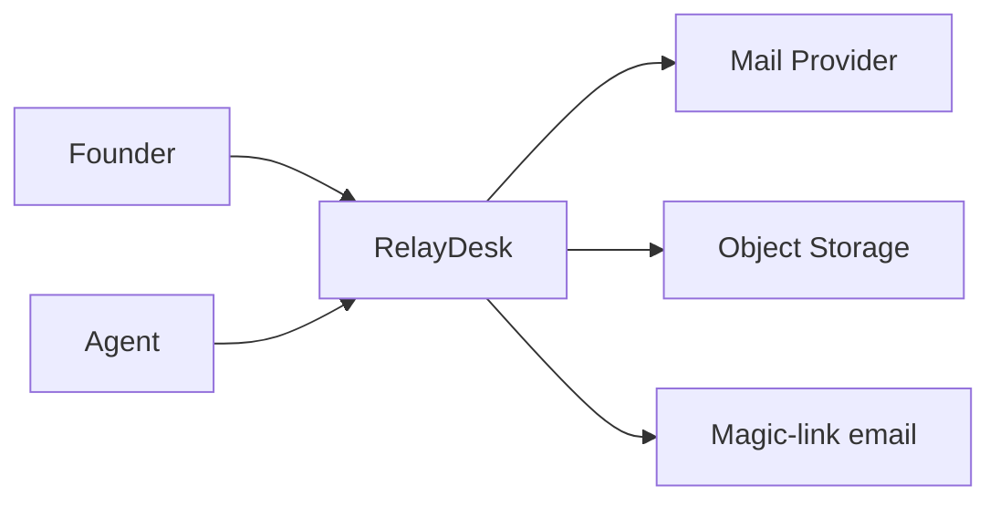
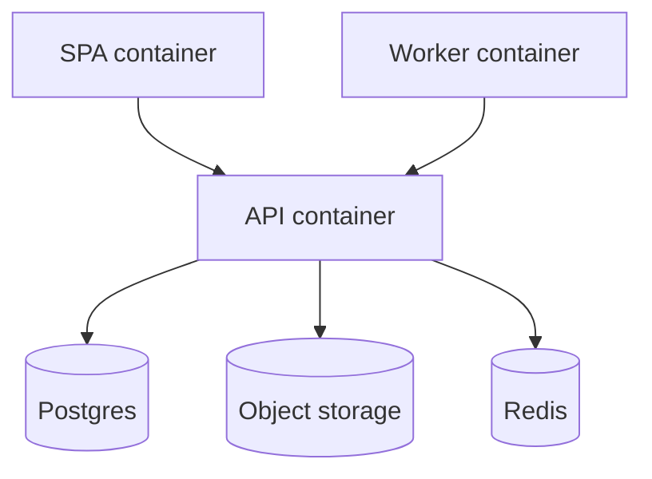

# Sample Architecture — RelayDesk

## Executive summary

RelayDesk is a small-system support inbox: SPA, API, email worker, Postgres, and object storage. Critical areas are email sync reliability, reply idempotency, and HTML sanitization of inbound mail.

## Context

## Containers

## ADRs

### Magic-link sessions instead of passwords

**Context:** Indie users hate password reset loops; support tool login must be low friction.

**Options:**
- Password + email verify
- Magic link sessions
- OAuth-only Google

**Decision:** Magic link issuing HttpOnly session cookies

**Consequences:**
- Simpler UX
- Depends on transactional email deliverability
- No password DB

**Revisit when:** Enterprise SSO demand appears or email deliverability is chronically poor

### Transactional outbox for domain events

**Context:** Need reliable analytics/notifications without dual-write bugs.

**Options:**
- Direct emit after commit
- Outbox table + poller
- External queue only

**Decision:** Postgres outbox polled by worker

**Consequences:**
- At-least-once delivery
- Extra table
- Simple ops

**Revisit when:** Event volume exceeds poller capacity

### Strict HTML sanitization on inbound mail

**Context:** Email HTML is a XSS vector in the agent UI.

**Options:**
- iframe sandbox only
- Server-side sanitizer allowlist
- Plain-text only

**Decision:** Server-side sanitizer with conservative allowlist plus CSP

**Consequences:**
- Some layout loss in emails
- Strong XSS reduction

**Revisit when:** Customers require richer HTML rendering

## Failure modes

### Mail provider OAuth revoked

- Impact: Inbound sync stops
- Detection: sync_lag alert + settings banner
- Runbook: Notify owner; Settings reconnect OAuth; backfill last 24h

### Postgres primary failover

- Impact: Brief API errors
- Detection: 5xx spike
- Runbook: Rely on managed failover; pause worker; verify migrations
