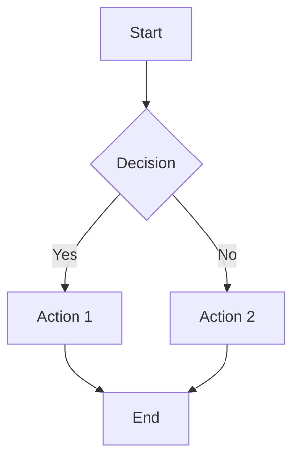
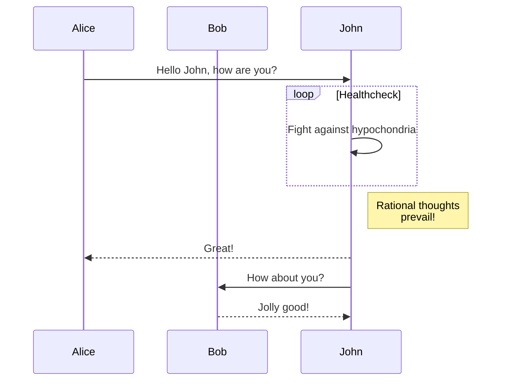
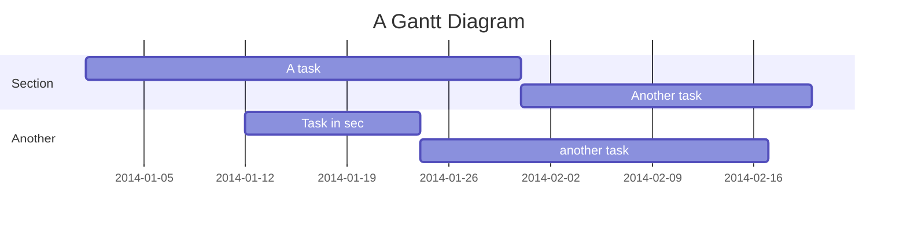
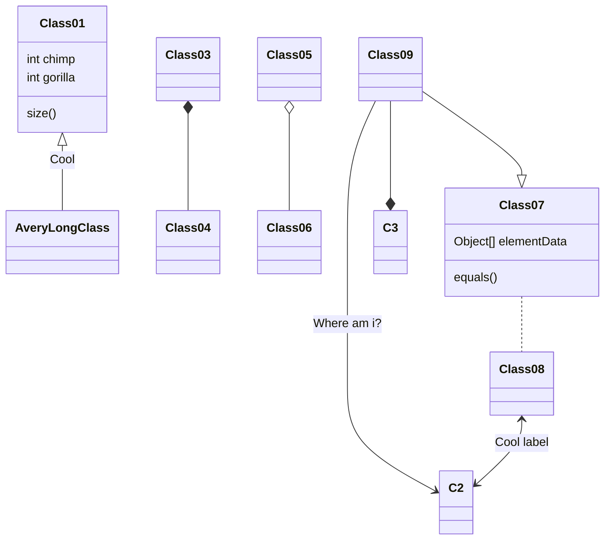
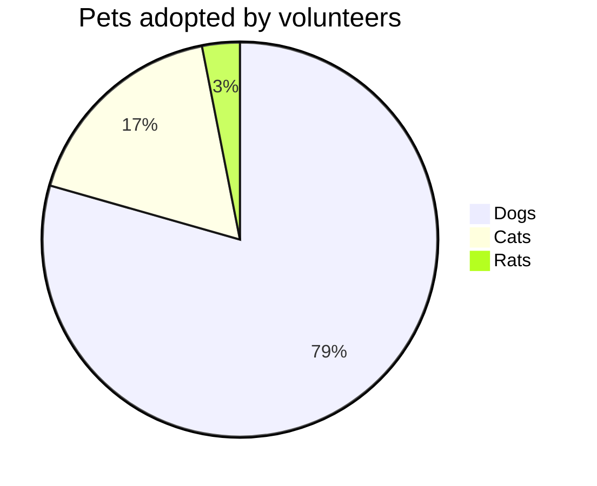
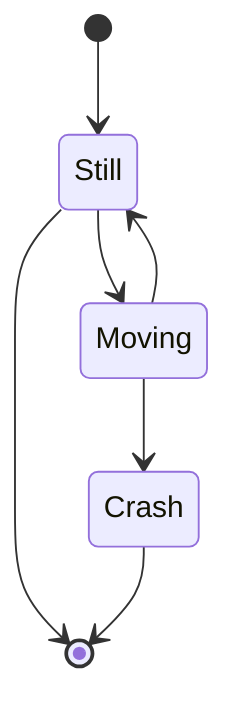

# Mermaid Charts Integration - Specifys.ai

## Overview
This document describes the comprehensive Mermaid charts integration for Specifys.ai, providing built-in support for creating and displaying various types of diagrams and flowcharts.

## Features

### ✅ Complete Integration
- **Dark/Light Theme Support** - Automatically adapts to site theme
- **Responsive Design** - Works on all device sizes
- **Interactive Editor** - Built-in chart editor with live preview
- **Multiple Chart Types** - Support for all Mermaid chart types
- **Error Handling** - Graceful error display with helpful messages
- **Loading States** - Visual feedback during chart rendering
- **Print Support** - Optimized for printing

### 📊 Supported Chart Types
1. **Flowchart** - Process flows and decision trees
2. **Sequence Diagram** - User interactions and system flows
3. **Gantt Chart** - Project timelines and schedules
4. **Class Diagram** - Object-oriented design
5. **State Diagram** - State machines and workflows
6. **Pie Chart** - Data visualization
7. **Git Graph** - Version control visualization
8. **Entity Relationship** - Database design
9. **User Journey** - User experience mapping

## File Structure

```
assets/
├── css/components/
│   ├── mermaid.css          # Mermaid styling
│   └── MERMAID-README.md   # This documentation
└── js/
    └── mermaid.js          # Mermaid integration logic
```

## Usage

### Basic Chart Rendering

```html
<!-- Include the CSS and JS -->
<link rel="stylesheet" href="assets/css/main.css">
<script src="assets/js/mermaid.js"></script>

<!-- Create chart container -->
<div class="mermaid-container">
    <div class="mermaid-controls">
        <h3 class="mermaid-title">My Chart</h3>
        <div class="mermaid-actions">
            <button class="mermaid-btn" onclick="renderMyChart()">Render</button>
        </div>
    </div>
    <div id="my-chart" class="mermaid-chart"></div>
</div>

<script>
function renderMyChart() {
    const definition = `
        graph TD
            A[Start] --> B{Decision}
            B -->|Yes| C[Action 1]
            B -->|No| D[Action 2]
            C --> E[End]
            D --> E
    `;
    
    mermaidManager.renderChart('my-chart', definition, {type: 'flowchart'});
}
</script>
```

### Interactive Editor

```html
<!-- Create editor container -->
<div class="mermaid-container">
    <div id="my-editor"></div>
</div>

<script>
// Initialize editor with example
const exampleChart = `
    sequenceDiagram
        participant User
        participant System
        User->>System: Request
        System-->>User: Response
`;

mermaidManager.createEditor('my-editor', exampleChart);
</script>
```

### Chart Examples

```javascript
// Get predefined examples
const examples = mermaidManager.getExamples();

// Flowchart
mermaidManager.renderChart('container', examples.flowchart, {type: 'flowchart'});

// Sequence Diagram
mermaidManager.renderChart('container', examples.sequence, {type: 'sequence'});

// Gantt Chart
mermaidManager.renderChart('container', examples.gantt, {type: 'gantt'});

// Class Diagram
mermaidManager.renderChart('container', examples.class, {type: 'class'});

// Pie Chart
mermaidManager.renderChart('container', examples.pie, {type: 'pie'});

// State Diagram
mermaidManager.renderChart('container', examples.state, {type: 'state'});
```

## CSS Classes

### Container Classes
```css
.mermaid-container          /* Main chart container */
.mermaid-chart             /* Chart display area */
.mermaid-controls          /* Header with title and actions */
.mermaid-title             /* Chart title */
.mermaid-actions           /* Action buttons container */
.mermaid-btn               /* Action button styling */
```

### Chart Type Classes
```css
.mermaid-flowchart         /* Flowchart specific styling */
.mermaid-sequence          /* Sequence diagram styling */
.mermaid-gantt             /* Gantt chart styling */
.mermaid-class             /* Class diagram styling */
.mermaid-state             /* State diagram styling */
.mermaid-pie               /* Pie chart styling */
.mermaid-git                /* Git graph styling */
.mermaid-er                 /* Entity relationship styling */
.mermaid-journey            /* User journey styling */
```

### State Classes
```css
.mermaid-loading           /* Loading state */
.mermaid-error             /* Error state */
.mermaid-error-icon        /* Error icon */
.mermaid-error-title       /* Error title */
.mermaid-error-message     /* Error message */
.mermaid-error-code        /* Error code display */
```

### Editor Classes
```css
.mermaid-editor            /* Editor container */
.mermaid-editor-header     /* Editor header */
.mermaid-editor-title      /* Editor title */
.mermaid-editor-actions    /* Editor action buttons */
.mermaid-editor-content    /* Editor main content */
.mermaid-editor-input      /* Input section */
.mermaid-editor-label      /* Input label */
.mermaid-editor-textarea   /* Textarea for chart definition */
.mermaid-editor-preview    /* Preview section */
.mermaid-editor-preview-label    /* Preview label */
.mermaid-editor-preview-content /* Preview content area */
```

## JavaScript API

### MermaidManager Class

#### Methods

```javascript
// Initialize Mermaid
await mermaidManager.initialize()

// Render a chart
await mermaidManager.renderChart(containerId, definition, options)

// Create interactive editor
mermaidManager.createEditor(containerId, initialDefinition, options)

// Render chart from editor
await mermaidManager.renderFromEditor(editorId)

// Clear editor
mermaidManager.clearEditor(editorId)

// Update theme (called automatically)
mermaidManager.updateTheme()

// Get chart examples
const examples = mermaidManager.getExamples()

// Show loading state
mermaidManager.showLoading(containerId)

// Show error state
mermaidManager.showError(containerId, message)
```

#### Configuration

```javascript
mermaidManager.config = {
    theme: 'base', // or 'dark'
    themeVariables: {
        primaryColor: '#0078d4',
        primaryTextColor: '#333333',
        // ... more theme variables
    },
    flowchart: {
        useMaxWidth: true,
        htmlLabels: true
    },
    // ... more chart configurations
};
```

## Chart Definition Examples

### Flowchart


### Sequence Diagram


### Gantt Chart


### Class Diagram


### Pie Chart


### State Diagram


## Theme Integration

The Mermaid integration automatically adapts to the site's theme:

- **Light Theme**: Clean, professional appearance
- **Dark Theme**: Dark backgrounds with appropriate contrast
- **Automatic Switching**: Responds to `data-theme` attribute changes

## Responsive Design

- **Desktop**: Full-featured editor with side-by-side layout
- **Tablet**: Stacked layout with optimized spacing
- **Mobile**: Single-column layout with touch-friendly controls

## Error Handling

The system provides comprehensive error handling:

- **Syntax Errors**: Clear error messages with code highlighting
- **Rendering Errors**: Graceful fallback with error display
- **Network Issues**: Loading state management
- **Invalid Definitions**: Helpful error messages

## Performance

- **Lazy Loading**: Charts render only when needed
- **Caching**: Rendered charts are cached for performance
- **CDN**: Mermaid library loaded from reliable CDN
- **Optimized**: Minimal impact on page load times

## Browser Support

- **Modern Browsers**: Full support for all features
- **Mobile Browsers**: Optimized for touch interfaces
- **Fallbacks**: Graceful degradation for older browsers

## Best Practices

1. **Use Semantic IDs**: Choose descriptive container IDs
2. **Provide Examples**: Include sample charts for users
3. **Handle Errors**: Always provide fallback content
4. **Optimize Definitions**: Keep chart definitions readable
5. **Test Responsiveness**: Verify charts work on all devices
6. **Use Appropriate Types**: Choose the right chart type for your data

## Integration Notes

- The system automatically initializes when the page loads
- Theme changes are detected and applied automatically
- All charts are responsive and accessible
- The editor provides real-time preview functionality
- Error states are user-friendly and informative
