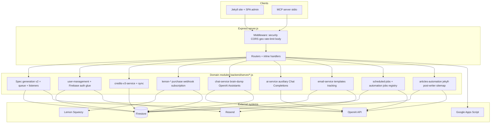
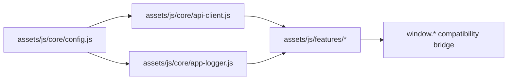

# Specifys.ai — System Architecture

Single source of truth for the system architecture. Describes every subsystem, service, data store, and flow as they exist in production.

**Last updated:** May 2026 (full architecture refresh: Credits V3 hard cutover, spec-viewer nav/progress, content automation + Jekyll articles, admin dashboard, analytics page views, deployment model)

---

## Table of Contents

1. [System Overview](#1-system-overview)
2. [Technology Stack](#2-technology-stack)
3. [Project Structure](#3-project-structure)
4. [Backend](#4-backend)
   - [Backend topology & module map](#40-backend-topology--module-map)
   - [Entry & Middleware](#41-entry--middleware)
   - [Routes](#42-routes)
   - [Spec Engine v2](#43-spec-engine-v2)
   - [User Management](#44-user-management)
   - [Credits System (V3)](#45-credits-system-v3)
   - [Payments — Lemon Squeezy](#46-payments--lemon-squeezy)
   - [Chat & Brain Dump](#47-chat--brain-dump)
   - [Email — Resend Integration](#48-email--resend-integration)
   - [Admin, Analytics & Content](#49-admin-analytics--content)
   - [Automation & Scheduled Jobs](#410-automation--scheduled-jobs)
   - [Auxiliary API Migration](#411-auxiliary-api-migration)
   - [Architecture improvement directions](#412-architecture-improvement-directions)
5. [Frontend](#5-frontend)
   - [Page Loading Model](#51-page-loading-model)
   - [Core Modules](#52-core-modules)
   - [Features](#53-features)
   - [Admin Dashboard](#54-admin-dashboard)
   - [CSS / Design System](#55-css--design-system)
6. [MCP Server](#6-mcp-server)
7. [Data Layer — Firestore](#7-data-layer--firestore)
8. [Infrastructure & Deployment](#8-infrastructure--deployment)
9. [Key Flows](#9-key-flows)
10. [Environment Variables](#10-environment-variables)
11. [Known Issues & Legacy](#11-known-issues--legacy)

---

## 1. System Overview

Specifys.ai is an AI-powered specification generator. Users describe an app idea and the system produces a dependency-driven specification pipeline: Overview -> Technical / Market / Design -> Architecture / GEO & SEO Visibility Engine -> Prompts. Additional features (AI Chat Assistant, Brain Dump, Export & Integration, MCP) consume these generated outputs.

### Communication Architecture

The system uses three OpenAI integration patterns:

1. **Spec Generation (v2):** Direct **Chat Completions API** with **Structured Outputs** (strict JSON schema via Zod). No threads, no assistants runs — a single `POST /v1/chat/completions` call per stage. This replaced the legacy Cloudflare Worker approach.

2. **Chat & Brain Dump:** OpenAI **Assistants API** with threads, runs, and `file_search` (spec uploaded to vector store). Conversational context is maintained via real OpenAI threads.

3. **Auxiliary features** (mockups, prompts, mindmap, jira export): now use backend `/api/auxiliary/*` endpoints on Express.

```
┌──────────────────┐     ┌──────────────────────┐     ┌────────────────────────┐
│  Jekyll Static   │     │  Express Backend      │     │  OpenAI API            │
│  Site + Firebase │────▶│  (Render)             │     │                        │
│  Client SDK      │     │                       │─────│─▶ Chat Completions     │
└──────┬───────────┘     │  ┌─────────────────┐  │     │   (spec generation v2) │
       │                 │  │ Spec Engine v2   │──│─────│─▶ Structured Outputs   │
       │                 │  │ Chat Completions │  │     │   (Zod JSON schema)    │
       │                 │  └─────────────────┘  │     │                        │
       │                 │  ┌─────────────────┐  │     │─▶ Assistants API       │
       │                 │  │ Chat Service     │──│─────│   (threads + runs +    │
       │                 │  │ Assistants API   │  │     │    file_search)        │
       │                 │  └─────────────────┘  │     │                        │
       │                 │  ┌─────────────────┐  │     │─▶ Whisper API          │
       │                 │  │ Live Brief       │──│─────│   (audio transcription)│
       │                 │  └─────────────────┘  │     └────────────────────────┘
       │                 │                       │
       │                 │                       │────▶ Firestore
       │                 │                       │────▶ Lemon Squeezy (payments)
       │                 │                       │────▶ Resend (email)
       │                 └──────────────────────┘
       │
       │                 │  ┌─────────────────┐  │
       └────────────────▶│  │ Auxiliary API    │──│─────▶ Chat Completions
                         │  │ /api/auxiliary/* │  │       (gpt-4o-mini)
                         │  └─────────────────┘  │
                         └──────────────────────┘

┌──────────────┐
│  MCP Server  │───▶ Backend REST API (API key auth)
│  (stdio)     │
└──────────────┘
```

### Three OpenAI Calling Patterns

| Pattern | Used By | How |
|---------|---------|-----|
| **Chat Completions + Structured Outputs** | Spec Engine v2, Live Brief summary, Clarify | `POST /v1/chat/completions` with `response_format: { type: 'json_schema', json_schema: { strict: true } }` |
| **Assistants API (threads + runs + file_search)** | Chat with spec, Brain Dump, Diagram repair | `POST /v1/threads`, `POST /v1/threads/:id/messages`, `POST /v1/threads/:id/runs` |
| **Auxiliary API (frontend → backend → OpenAI)** | Mockups, Prompts, Mindmap, Jira | Frontend `fetch()` → `/api/auxiliary/*` → backend `ai-service.js` |

---

## 2. Technology Stack

| Layer | Technology |
|-------|-----------|
| Static Site Generator | Jekyll (Ruby) + Liquid templates |
| Frontend JS | Vanilla JS (no framework), per-page `<script>` tags |
| CSS | SCSS → compiled `main-compiled.css` + per-page CSS; PostCSS pipeline (autoprefixer, cssnano, purgecss) |
| Build Tool | Vite (configured but bundles not used at runtime — pages load JS directly) |
| Backend | Node.js + Express 5 |
| Database | Google Firestore (Firebase Admin SDK) |
| Auth | Firebase Authentication (client SDK + server token verification) |
| AI / LLM (spec gen) | OpenAI Chat Completions API with Structured Outputs (strict JSON schema via Zod) |
| AI / LLM (chat, brain dump) | OpenAI Assistants API v2 (threads, runs, file_search with vector stores) |
| AI / LLM (auxiliary) | Express auxiliary routes + OpenAI Chat Completions (`gpt-4o-mini`) |
| AI / LLM (live brief) | OpenAI Whisper (transcription) + Chat Completions (summary) |
| Payments | Lemon Squeezy (checkout + webhooks) |
| Email | Resend SDK |
| Edge Functions | Deprecated (auxiliary worker runtime removed) |
| MCP | TypeScript MCP server (`@modelcontextprotocol/sdk`) via stdio |
| Deployment | **Render** — single Node service (`specifys-backend`) serves REST API + built `_site` static assets; Jekyll build runs in CI/local, not as a separate Pages runtime |
| Monorepo | npm workspaces (`packages/*`) — packages exist but are not used at runtime |

---

## 3. Project Structure

```
specifys-ai/
├── _config.yml                  # Jekyll config
├── _includes/                   # Jekyll HTML partials (head, header, firebase, spec-viewer-navigation, structured-data, …)
├── _layouts/                    # Jekyll layouts (5: default, standalone, auth, post, dashboard)
├── _plugins/                    # Jekyll plugins (vite_manifest.rb)
├── _posts/                      # Blog posts (Markdown) — manual + automation via jekyll-post-writer
├── _redirects                   # Redirect rules (included in Jekyll build)
├── assets/
│   ├── css/                     # SCSS + compiled CSS (~87 files)
│   ├── dist/                    # Vite build output (not used at runtime)
│   ├── icons/                   # SVG/PNG icons
│   ├── images/                  # Site images
│   └── js/                      # Frontend JavaScript
│       ├── core/                # Config, logger, security, store
│       ├── services/            # API client, caches, analytics, Firestore listeners
│       ├── components/          # Base component, Modal
│       ├── features/            # Feature modules (index, planning, spec-viewer, profile, …)
│       ├── services/            # analytics-tracker.js, caches, Firestore listeners
│       ├── new-admin-dashboard/ # Admin SPA (ES modules)
│       ├── pages/               # Page-specific JS (credits-v3-*, pricing, articles, …)
│       ├── utils/               # Utilities
│       └── bundles/             # Vite entry points (unused at runtime)
├── backend/
│   ├── package.json             # Backend dependencies (Express 5, Firebase Admin, OpenAI, …)
│   ├── schemas/                 # Zod schemas (spec-schemas.js, mermaid-validator.js)
│   ├── scripts/                 # Sitemap, migration, backfill utilities
│   ├── firestore.indexes.json   # Composite indexes (users, automation_logs, …)
│   └── server/                  # Express app (~81 JS modules)
│       └── server.js            # Entry point (~1,230 lines)
├── blog/                        # Blog index page
├── docs/                        # Documentation
├── mcp-server/                  # MCP server (TypeScript)
│   └── src/                     # index.ts, api.ts
├── packages/                    # Monorepo workspaces (not used at runtime)
│   ├── api-client/
│   ├── design-system/
│   └── ui/
├── pages/                       # HTML pages (~29 files)
├── scripts/                     # check-env.mjs, favicon, blog/archive utilities
├── tests/e2e/                   # Playwright (spec-viewer smoke)
├── tools/                       # Vibe Coding Tools Map (tools/map/tools.json export)
├── index.html                   # Homepage
├── package.json                 # Root workspace config
├── render.yaml                  # Render deployment config (API-only service; serves _site when built)
├── Procfile                     # web: cd backend && npm start
└── vite.config.js               # Vite config
```

---

## 4. Backend

All backend code lives in `backend/`. Entry point: `backend/server/server.js`. Deployed on **Render** as a single Node process that serves both the REST API and (for convenience) selected static assets from the repo’s `_site` build output alongside dynamic blog routing.

### 4.0 Backend topology & module map

High-level layering (logical, not separate deployables):



**Directory roles**

| Location | Responsibility |
|---------|----------------|
| `backend/server/server.js` | Process bootstrap: env load, middleware, route registration order, static fallbacks (`_site`), graceful shutdown hooks |
| `backend/server/config.js` | Canonical URLs (`BACKEND_BASE_URL`, `BACKEND_URL`), port, **CORS allowlist**, `creditsV3.enabled` (production requires `CREDITS_V3_ENABLED=true`) |
| `backend/server/firebase-admin.js` | Firebase Admin singleton; Firestore + Auth used across routes/services |
| `backend/server/middleware/` | Shared HTTP concerns: `auth.js` (Firebase ID token → `req.user`), `geo.js`, `error-response.js` |
| `backend/schemas/` | Zod spec schemas shared with generation (`spec-schemas.js`) |
| `backend/server/*-routes.js` | Thin HTTP adapters: validate input, call services, shape JSON responses |
| `backend/server/*-service.js` | Business logic, Firestore transactions, orchestration |
| `backend/server/articles-automation.js` | Daily article writer (`ArticleWriterJob`), Firestore `articles` + Jekyll `_posts/` |
| `backend/server/jekyll-post-writer.js` | Writes `_posts/YYYY-MM-DD-slug.md` (local FS or GitHub Contents API) |
| `backend/server/tools-automation.js` | Weekly tools finder + export to `tools/map/tools.json` |
| `backend/server/sitemap-generator.js` | Dynamic `sitemap.xml`, optional IndexNow ping |
| `backend/server/resend-audience-bulk-sync.js` | Admin batch sync of `users` → Resend audience |

**Heavy coupling points (today)** — intentional for velocity, targets for gradual refactors: `server.js` concentration (API + static + blog dynamic route), pervasive `require('./firebase-admin')`, and mixed **Chat Completions** vs **Assistants API** stacks inside `openai-storage-service.js`.

**Route registration order (summary)** — order matters where paths overlap (`/:year/:month/:day/:slug/` vs static) or middleware must run first (Lemon webhook, body parsing):

1. Lemon router at `/api/lemon` (**before** global JSON parsing on other paths; webhook signature uses raw elsewhere in lemon router stack).
2. Rate limits: `/api/` general (excluding paths under `/api/lemon`), `/api/auth/`, `/api/feedback`.
3. Body parsing: special-case `POST /api/analytics/web-vitals` (raw → JSON), then `express.json()` for remaining routes.
4. Core routers: `/api/users`, `/api/specs`, `/api/mcp` (**`verifyApiKey`** then `mcpRoutes`).
5. **Conditional:** when `config.creditsV3.enabled`: `/api/v3/credits`, `/api/share-prompt`.
6. Chat / brain-dump / auxiliary.
7. Blog + articles + academy: partly **inline** `app.get`/`app.post` on `server.js` (not all via `Router()` mounts).
8. `/api/analytics`, then **`/api/admin`** with extra wrapper middleware (structured logging + `rateLimiters.admin` + `adminRoutes`).
9. Health, Swagger `/api-docs`, `/api/status`, `/api/sync-users`, feedback/contact, stats, live-brief, planning, tool-finder, `/api/email` (preview + tracking mount **twice** on same prefix), newsletters, tools, automation.
10. Static: built index, academy, `/blog/`, dynamic Firebase post matcher, repo-root `express.static`, 404 + global `errorHandler`.

### 4.1 Entry & Middleware

**File:** `backend/server/server.js`

Bootstrap (before middleware): optional dotenv (`backend/.env`, repo root `.env`, `server/.env`), `initializeErrorCapture()` (`render-error-capture.js`), `assertEnv()` (`env-check.js`).

Middleware chain (**actual order relevant to Geo + parsers**):

1. **Trust proxy** — `trust proxy` = `1` (Render)
2. **Security headers** — `securityHeaders` from `security.js` (Helmet: CSP and related headers tuned for Firebase / analytics)
3. **Compression**
4. **CORS** — inline middleware; reflected allowlist from `config.allowedOrigins` (**plus** conditional `Origin` echo only when listed)
5. **`geoMiddleware`** — `middleware/geo.js` attaches `req.geo` **before** JSON parsing (powers `/api/geo/context` and any handler that reads geo early)
6. **`/api/lemon`** — Lemon router (**before** the global `/api/` rate-limit + default JSON parsing path described below; webhook stack handles raw body as defined in lemon routes)
7. **Rate limiting:**
   - `rateLimiters.general` on `/api/` **except** paths starting with `/lemon` (Lemon already mounted)
   - `rateLimiters.auth` on `/api/auth/`
   - `rateLimiters.feedback` on `/api/feedback`
8. **Body parsing:** `POST /api/analytics/web-vitals` — `express.raw` then parse JSON (sendBeacon compatibility); all other routes — `express.json()`
9. **Request logging** — assigns `req.requestId`; logs API requests and error responses (skips routine `/api/health`, `/api/status`)
10. **Route handlers** — mix of inline admin/diagnostic routes and `app.use(...)` routers (see §4.0 mount summary)
11. **`notFoundHandler` then `errorHandler`** — end of pipeline

Rate limit reference (`security.js`): general **100 / 15 min** per IP; admin **300 / 15 min** (`rateLimiters.admin` on `/api/admin` stack); auth **5 / 15 min**; feedback **10 / hour** (separate bucket from general API).

**Config** (`backend/server/config.js`): `BACKEND_BASE_URL`, `BACKEND_URL`, `API_VERSION`, port (default 10000), CORS origins, Google Apps Script URL (feedback Sheets bridge), **`creditsV3.enabled`** (production: only `true` when `CREDITS_V3_ENABLED=true`).

**Startup validation:** `env-check.js` (`assertEnv`) validates required env vars before the HTTP server listens.

### 4.2 Routes

Mounted routers (see §4.0 for ordering and edge cases). **`mcp-routes.js`** is always wrapped with **`verifyApiKey`** (`mcp-auth.js`) at mount time. **`admin-routes.js`** is mounted after **request logging + admin-only rate limiter** (`rateLimiters.admin`): stack is `loggingMiddleware → rateLimiters.admin → adminRoutes` on `/api/admin`.

| Route File | Base Path | Purpose |
|-----------|-----------|---------|
| `specs-routes.js` | `/api/specs` | Spec CRUD, generation (v2), upload to OpenAI |
| `auxiliary-routes.js` | `/api/auxiliary` | Mockup, prompts, mindmap, jira auxiliary generation |
| `user-routes.js` | `/api/users` | User init, profile, MCP key management |
| `credits-v3-routes.js` | `/api/v3/credits` | Credits: get, consume, grant, refund, ledger (mounted only when `config.creditsV3.enabled`; production → `CREDITS_V3_ENABLED=true`) |
| `chat-routes.js` | `/api/chat` | Chat: init, message, diagrams, demo |
| `brain-dump-routes.js` | `/api/brain-dump` | Brain dump: generate, apply to spec, legacy chat endpoints |
| `admin-routes.js` | `/api/admin` | Admin: users, specs, credits, payments, activity (after admin rate limit middleware) |
| `lemon-routes.js` | `/api/lemon` | Lemon Squeezy: checkout, webhooks, subscription status |
| `health-routes.js` | `/api/health` | Health checks (general, DB, OpenAI, credits) |
| `analytics-routes.js` | `/api/analytics` | Analytics event recording |
| `blog-routes.js` | handlers only | Blog CRUD handlers; **wired inline** in `server.js` under `/api/blog/*` (not `app.use`) |
| `blog-routes-public.js` | handlers only | Public list/get handlers; **`/api/blog/public/posts`** and **`/api/blog/public/post`** in `server.js` |
| `articles-routes.js` | `/api/articles` + `GET /sitemap.xml` | Article CRUD-ish operations and **top-level** sitemap mounted **inline** in `server.js` |
| `mcp-routes.js` | `/api/mcp` | MCP: specs list/get/update, tools (API key auth) |
| `share-prompt-routes.js` | `/api/share-prompt` | Share-prompt UX (check + record actions); **same gate as credits V3** (`config.creditsV3.enabled`) |
| `live-brief-routes.js` | `/api/live-brief` | Voice input: Whisper transcription + GPT summary |
| `planning-routes.js` | `/api/planning` | Planning flow API |
| `tools-routes.js` | `/api/tools` | Vibe Coding Tools management + export |
| `tool-finder-routes.js` | `/api/tool-finder` | Tool finder search |
| `stats-routes.js` | `/api/stats` | Public stats |
| `newsletter-routes.js` | `/api/admin/newsletters` | Newsletter management |
| `email-preview-routes.js` | `/api/email` | Email template preview |
| `email-tracking-routes.js` | `/api/email` | Email open/click tracking |
| `automation-routes.js` | `/api/automation` | Automation job management |
| `academy-routes.js` | `POST …/guides/:guideId/view` only | Academy view counting; **single route** registered in `server.js` |
| `api-docs-routes.js` | `/api-docs` | Swagger UI |

**Inline routes & static behavior in `server.js`:**

| Path | Purpose | Notes |
|------|---------|-------|
| `GET /api/admin/error-logs` | Paginated/error-typed logs | `requireAdmin`; `error-logger.js` |
| `GET /api/admin/error-summary` | Aggregate error stats | `requireAdmin` |
| `POST /api/admin/css-crash-logs` | Persist client CSS crash reports | Writes via `css-crash-logger.js` |
| `GET /api/admin/css-crash-logs` | List CSS crash logs | `requireAdmin`; filters optional |
| `GET /api/admin/css-crash-summary` | Crash summary | `requireAdmin` |
| `POST /api/logs` | Client structured logs | Stdout/logger only (no Firestore persistence) |
| `GET /api/logs` | — | Returns **405** (discourage crawlers) |
| `POST /api/sync-users` | Firebase Auth → Firestore user sync | `requireAdmin`; `user-management.syncAllUsers` |
| `POST /api/feedback` | Feedback email via `email-service.sendFeedbackEmail` (Resend) + Google Apps Script | Also `rateLimiters.feedback` on handler |
| `POST /api/contact` | Contact form → Firestore `contactSubmissions` | Uses `rateLimiters.feedback` |
| `GET /api/geo/context` | Lightweight region context for localized suggestions | Public, `Cache-Control: public, max-age=3600` |
| `GET /api/status` | Liveness JSON | Lightweight; omitted from noisy request logs |

**Static & HTML:** after API routes the process serves **`/` and `/index.html`** from `_site/index.html`, **`/academy.html`**, **`/blog/`** (built blog index), **`/blog/assets/*`**, dynamic **`/:year/:month/:day/:slug/`** resolving Firebase `blogQueue` → `pages/dynamic-post.html`, then broad **`express.static`** on repo root and **`/2025`** for archived posts. Keeps previews working on Render when API and site ship together; if you split deploys later, peel this layer out first.

### 4.3 Spec Engine v2

The core product engine. Replaced the legacy Cloudflare Worker–based flow with **direct Chat Completions API calls** and **Structured Outputs** (strict JSON schema generated from Zod). No OpenAI threads or assistant runs are used for spec generation — each stage is a single stateless `POST /v1/chat/completions` call.

**Components:**

| File | Role |
|------|------|
| `spec-generation-service-v2.js` | Orchestrates generation for overview, technical, market, design, architecture, visibility, prompts. Builds prompts, calls thread manager, runs the diagram QA pipeline (`_processDiagrams`), emits events |
| `spec-thread-manager.js` | Model resolution (`resolveSpecGeneratorTarget`), calls `openaiStorage.runSpecGeneration`, Zod validation of response, single-diagram repair sub-call (`repairMermaidDiagram`) |
| `openai-storage-service.js` | Low-level OpenAI HTTP: `runSpecGeneration` → `POST /v1/chat/completions`. Also has Assistants API methods for chat/brain-dump (separate from spec gen) |
| `spec-queue.js` | In-memory queue (concurrency=1) for `generateAllSpecs` background jobs |
| `spec-queue-firestore-listeners.js` | Attaches `spec.update`/`spec.complete`/`spec.error` listeners that sync generation status to Firestore |
| `spec-events.js` | EventEmitter for generation progress (`spec.update`, `spec.complete`, `spec.error`) |
| `spec-overview-utils.js` | Extracts title from overview content |
| `schemas/spec-schemas.js` | Zod schemas for overview, technical, market, design, architecture, visibility, prompts + `buildResponseFormat(stage)` + `parseAndValidateStage(stage, raw)` |
| `schemas/mermaid-validator.js` | Sanitizer (`sanitizeMermaid`), heuristic validator (`validateMermaid`), and per-stage diagram field map (`DIAGRAM_FIELDS`) used by the diagram QA pipeline |
| `pipeline-canary-service.js` | Automated pipeline health test — creates a canary spec through the full v2 pipeline |

#### How It Calls OpenAI (the key innovation)

The v2 engine uses **Chat Completions with Structured Outputs** — not the Assistants API:

1. **`resolveSpecGeneratorTarget()`** (in `spec-thread-manager.js`):
   - If `OPENAI_SPEC_GENERATOR_ASSISTANT_ID` env var is set → `{ mode: 'assistant', assistantId }` (fetches model + instructions from the assistant record via `GET /v1/assistants/:id`, but does **not** use threads/runs)
   - Otherwise → `{ mode: 'direct', model: OPENAI_SPEC_GENERATION_MODEL || 'gpt-5.6-luna', instructions }` (no assistant at all)

2. **`runSpecGeneration(threadId, target, userMessage, responseFormat)`** (in `openai-storage-service.js`):
   - `threadId` parameter is **unused** (legacy correlation — for new specs the value is `'chat-completions'`)
   - Resolves `model` and `instructions` from target (either from assistant record or direct config)
   - Builds: `{ model, messages: [{ role: 'system', content: instructions }, { role: 'user', content: userMessage }], response_format }`
   - Token limit: models matching `/^o[0-9]/` or `/^gpt-5/` → `max_completion_tokens: 16384`; others → `max_tokens: 16384`
   - Calls **`POST https://api.openai.com/v1/chat/completions`**

3. **`buildResponseFormat(stage)`** (in `spec-schemas.js`):
   - Converts Zod schema → JSON Schema via `zod-to-json-schema`
   - Unwraps `$ref` envelope so root is `type: "object"` (OpenAI requirement)
   - Returns `{ type: 'json_schema', json_schema: { name, strict: true, schema } }`

4. **Zod validation**: Response is parsed with `parseAndValidateStage(stage, raw)` — fenced JSON markers are stripped if present

**No fallback chain.** A single model is used per deployment (configured once, cached). The documentation references to "gpt-5.2 → gpt-5-mini → ..." are aspirational comments, not implemented code.

#### Stages and Schemas

| Stage | Schema | Root Key | Key Fields |
|-------|--------|----------|------------|
| Overview | `OverviewPayloadSchema` | `overview` | ideaSummary, problemStatement, targetAudience, valueProposition, coreFeaturesOverview, userJourneySummary, detailedUserFlow, screenDescriptions, complexityScore |
| Technical | `TechnicalPayloadSchema` | `technical` | techStack, architectureOverview (with Mermaid), databaseSchema (with Mermaid), apiDesign (with Mermaid), dataFlow (with Mermaid), securityAuthentication, integrationExternalApis, devops, dataStorage, analytics |
| Market | `MarketPayloadSchema` | `market` | industryOverview, targetAudienceInsights, competitiveLandscape, swotAnalysis, monetizationModel, marketingStrategy |
| Design | `DesignPayloadSchema` | `design` | visualStyleGuide, logoIconography, uiLayout, uxPrinciples |
| Architecture | `ArchitecturePayloadSchema` | `architecture` | executiveSummary, systemBoundaries, logicalSystemArchitecture (with Mermaid), informationArchitecture (with Mermaid), functionalArchitecture (with Mermaid), repositoryStructure, coreFlows (sequence Mermaid), integrationLandscape (with Mermaid), deploymentTopology (with Mermaid), nonFunctionalQuality, observabilityOperability, securityArchitectureDeepDive, architectureDecisionLog, risksAndOpenDecisions |

Zod strict-mode rules: no `.optional()` (use `.nullable()`), no `z.record()`/`z.any()`, no mixed `z.union()`.

#### Generation Flow

```
generateOverview(specId, userInput)
  → resolveSpecGeneratorTarget() → model + instructions
  → POST /v1/chat/completions (OverviewPayloadSchema, strict JSON)
  → Zod validation → parseAndValidateStage('overview', raw)
  → Store JSON string in Firestore, set status.overview='ready'

generateAllSpecs(specId, overview, answers)  [via specQueue]
  → generateSection('technical', prompt) → POST /v1/chat/completions → Zod
                                         → _processDiagrams('technical', payload)   ← Mermaid QA
                                         → emitSpecUpdate
  → generateSection('market', prompt)    → POST /v1/chat/completions → Zod → emitSpecUpdate
  → generateSection('design', prompt)    → POST /v1/chat/completions → Zod → emitSpecUpdate
  → generateArchitecture(overview, technical, market, design)
      → POST /v1/chat/completions (ArchitecturePayloadSchema, strict JSON)
      → Zod validation
      → _processDiagrams('architecture', payload)                                  ← Mermaid QA
      → _architecturePayloadToMarkdown(payload) → fenced Mermaid blocks
      → emitSpecUpdate (Markdown stored in Firestore)
  → emitSpecComplete
```

#### Mermaid Diagram QA Pipeline

Strict JSON schemas (`buildResponseFormat`) only guarantee that diagram fields are *strings* — not that the strings are valid Mermaid. Without this pipeline, ~25% of generated diagrams broke `mermaid.parse()` at render time (markdown fences, smart quotes, emoji labels, missing directives, unbalanced brackets), which made entire Technical / Architecture sections look empty.

`_processDiagrams(stage, payload)` runs after Zod validation for the `technical` and `architecture` stages. It walks every Mermaid field listed in `DIAGRAM_FIELDS[stage]` and, for each:

1. **Sanitize** — `sanitizeMermaid(src)` is idempotent. It strips ` ```mermaid `…` ``` ` fences, normalizes typography (smart quotes, em-dash, NBSP, ellipsis), drops emoji and bidi controls, rewrites foreign-language directives (`grafico TD` → `graph TD`), uppercases direction tokens, and collapses HTML to plain `<br>` only.
2. **Validate** — `validateMermaid(src)` runs heuristics that mirror the failure modes seen in production logs:
   - First non-empty line must match an `ALLOWED_DIRECTIVES` token (`flowchart`, `graph`, `erDiagram`, `sequenceDiagram`, `classDiagram`, `stateDiagram-v2`, `mindmap`, `pie`, `gantt`, `journey`, …).
   - No leftover ` ``` ` fences or stray HTML other than `<br>`.
   - Bracket / paren balance, ignoring quoted labels and `%%` comments. Skipped for `erDiagram` because cardinality tokens (`||--o{`, `}o--||`) reuse `{` `}` as part of the relationship symbol.
   - Per-directive sanity: `sequenceDiagram` must contain at least one arrow; `erDiagram` needs a relationship or entity body; `flowchart` / `graph` need at least one edge; `mindmap` needs child nodes.
3. **Repair** — if the sanitized source still fails validation, `tm.repairMermaidDiagram(src, errors, kind)` issues a small dedicated Chat Completions call:
   - Tiny strict `response_format`: `{ type: 'json_schema', schema: { properties: { corrected: string }, required: ['corrected'], strict: true } }` so the model returns a single string, not a wrapped object.
   - System prompt is repair-tuned (`MERMAID_REPAIR_SYSTEM` in `spec-thread-manager.js`); when the main flow goes through an Assistant we override `mode: 'direct'` for this sub-call so the assistant's full-spec instructions don't leak into the repair.
   - User prompt feeds back the validator errors and a strict rules block.
   - At most one repair attempt per field — the cost of failing here is small (set to null or kept as-is) compared to looping.
4. **Degrade** — if repair still fails:
   - For nullable fields (every diagram except `databaseSchema.erDiagramMermaid`): set to `null`. Frontend will simply not render anything in that slot.
   - For non-nullable fields: keep the sanitized (still-broken) source. The frontend's inline diagram fallback (`buildInlineDiagramFallback` in `DiagramEngine.js` and the matching block in `spec-viewer-main.renderSpecMermaidPlaceholders`) shows a "Diagram preview unavailable" card with the source in a `<details>` block, so the rest of the section keeps rendering.

A per-stage summary log (`[DiagramQA] Diagram pipeline summary`) records `{ sanitized, repaired, dropped, kept_invalid }` counts so we can monitor regression in production.

The prompts in `spec-generation-service-v2.js` share a `MERMAID_RULES_BLOCK` constant (ASCII-only node IDs, quoted labels with spaces, no emoji, no HTML except `<br>`, exact ER cardinality tokens, ≤25 nodes). This keeps the model on the rails *before* QA runs and minimises the number of repair calls.

#### Queue and Events

**Queue** (`spec-queue.js`): Single-concurrency in-memory. `processJob` calls `specGenerationServiceV2.generateAllSpecs`. Jobs for the same `specId` replace finished ones. Cleanup after 5 minutes.

**Events** (`spec-events.js`): `spec.update`, `spec.complete`, `spec.error`.

**Firestore listeners** (`spec-queue-firestore-listeners.js`): Attached per `generate-all` request in `specs-routes.js`. On each event, patches the Firestore spec document: `status.{stage}`, section content, `generationVersion: 'v2'`. On `spec.complete`, optionally triggers OpenAI file upload (for chat).

#### Pipeline Canary

`pipeline-canary-service.js` — automated health test. Creates a canary spec (`pipelineCanary: true`) through the full v2 pipeline: `generateOverview` → `specQueue.add` → waits for all stages → records results. Runs daily if `PIPELINE_CANARY_ENABLED=true`. Expired canary specs are cleaned up automatically.

### 4.4 User Management

**Files:** `user-routes.js` (routes), `user-management.js` (service), `admin-config.js` (admin emails).

**Endpoints** (base: `/api/users`):

| Method | Path | Auth | Purpose |
|--------|------|------|---------|
| POST | `/initialize` | Firebase | Initialize user: create/update `users` doc + `user_credits_v3` doc, welcome credit, welcome email, Resend audience |
| GET | `/me` | Firebase | Get profile + credits |
| GET | `/me/mcp-api-key` | Firebase | Check if MCP key exists (key never returned) |
| POST | `/me/mcp-api-key` | Firebase | Create/regenerate MCP API key (returned once) |
| POST | `/me/mcp-event` | Firebase | Record MCP modal/page views |
| PUT | `/preferences/email` | Firebase | Update email preferences (newsletter, operational, marketing) |
| GET | `/preferences/email` | Firebase | Get email preferences |

**User initialization flow** (`initializeUser` in `user-management.js`):
1. Firestore transaction on `users/{uid}` and `user_credits_v3/{uid}` only (no `entitlements` doc)
2. Determines if new user (from client flag or doc existence)
3. New users: `plan: 'free'`, welcome credit (`balances.free: 1`)
4. Records `user_created` analytics event
5. Adds to Resend audience
6. Sends welcome email

**Admin:** `ADMIN_EMAILS` list in `admin-config.js` (currently `specifysai@gmail.com`). `isAdminEmail(email)` — case-insensitive check.

### 4.5 Credits System (V3)

**Status (May 2026):** **V3 hard cutover complete.** All V2 routes/services (`credits-v2-*`, parallel migration mode) were removed. Runtime credit flows use only `user_credits_v3` / `credit_ledger_v3`. Legacy Firestore `entitlements` may still exist on old accounts and in `firestore.rules`, but the application no longer reads or writes it for product flows.

**Service:** `credits-v3-service.js`
**Collections:** `user_credits_v3` (primary), `credit_ledger_v3` (transactions), `subscriptions_v3` (archive)

| Concept | Detail |
|---------|--------|
| Balance types | `paid`, `free`, `bonus` — stored in `balances` object |
| Total | Computed: `paid + free + bonus` |
| Consumption order | `free → bonus → paid` (configurable via `priority` param) |
| Pro subscription | `subscription.type === 'pro'` + `status in ['active', 'paid']` + `expiresAt` not past → unlimited creation |
| Welcome credit | New users get 1 free credit (`balances.free: 1`, `metadata.welcomeCreditGranted: true`); header UI (`credits-v3-display.js`) shows it immediately after `POST /api/users/initialize` without a full page reload |
| Idempotency | Consume: ledger doc ID `consume_{specId}_{userId}`. Grant: idempotent by transaction ID |
| Pro consume | Records ledger entry with `unlimited: true` without decrementing balances |
| Expiry | On `getAvailableCredits`, if Pro expired → auto-updates status to `'expired'`, restores `preservedCredits` to `paid` |

**Endpoints** (base: `/api/v3/credits`, mounted only when `CREDITS_V3_ENABLED=true`):

| Method | Path | Auth | Purpose |
|--------|------|------|---------|
| GET | `/` | Firebase | Get available credits (unlimited status, total, breakdown, subscription, permissions) |
| POST | `/consume` | Firebase | Consume 1 credit for a spec |
| POST | `/grant` | Admin | Grant credits to a user |
| POST | `/refund` | Firebase (admin for other users) | Refund credits |
| GET | `/ledger` | Firebase (admin for other users) | Credit transaction ledger |
| GET | `/history` | Firebase | Credit history summary |

**Credits sync** (`credits-sync-service.js` + `credits-sync-job.js`):
- Daily job (if `CREDITS_SYNC_ENABLED=true`): compares expected paid credits from `purchases` against `user_credits_v3.balances.paid`
- Syncs Lemon Squeezy subscription status → local Pro state
- Calls `enableProSubscription` / `disableProSubscription` when out of sync

Routes mounted at `/api/v3/credits` only when `CREDITS_V3_ENABLED=true`.

### 4.6 Payments — Lemon Squeezy

| File | Role |
|------|------|
| `lemon-routes.js` | Checkout, webhook handler, subscription cancel |
| `lemon-webhook-utils.js` | HMAC-SHA256 signature verification |
| `lemon-purchase-service.js` | Purchase recording in `purchases` collection |
| `lemon-credits-service.js` | Test purchase recording in `test_purchases` collection |
| `lemon-products-config.js` | Product/plan definitions (loaded from `assets/data/lemon-products.json`) |
| `lemon-subscription-resolver.js` | Subscription status resolution, Lemon API calls |
| `lemon-payments-cache.js` | Periodic payment data sync (24h cache in `payments_cache`) |

**Products:**

| Key | Name | Type | Credits |
|-----|------|------|---------|
| `pro_monthly` | Specifys Pro | subscription | unlimited |

**Endpoints** (base: `/api/lemon`):

| Method | Path | Auth | Purpose |
|--------|------|------|---------|
| POST | `/checkout` | Firebase | Create Lemon Squeezy checkout session |
| POST | `/subscription/cancel` | Firebase | Cancel subscription via Lemon API |
| POST | `/webhook` | Lemon signature | Process order_created + subscription_* events |
| GET | `/counter` | Public | Test purchase count |

**Webhook flow:**
1. Verify HMAC-SHA256 signature (`lemon-webhook-utils.js`)
2. Parse payload → extract `custom_data` (userId, email)
3. `order_created` → `creditsV3Service.grantCredits` (one-time) or `enableProSubscription` (subscription)
4. `subscription_updated/cancelled/expired` → `upsertSubscriptionFromWebhook` → `enableProSubscription` / `disableProSubscription`
5. Record in `purchases`, `subscriptions_v3`, `audit_logs`

**Webhook secret env:** set `LEMON_WEBHOOK_SECRET` in production (see §10 — `LEMON_SQUEEZY_WEBHOOK_SECRET` in `env-check` is a warning-only alias mismatch).

**External APIs:** Lemon Squeezy REST API (`api.lemonsqueezy.com/v1/`) for checkout, subscription cancel, order/subscription/customer lookups.

**Subscription status logic:** Active statuses: `active`, `on_trial`, `paused`, `past_due`, `paid`. Cancelled: `cancelled`, `expired`, `unpaid`.

### 4.7 Chat & Brain Dump

These features use the **OpenAI Assistants API** (threads + runs + file_search) — a different OpenAI pattern than spec generation (which uses Chat Completions).

**Chat** (`chat-service.js` + `chat-routes.js`):
- Uses **Assistants API with `file_search`**: spec is uploaded to OpenAI Files, attached to a vector store, linked to an assistant
- Per-spec assistant (cached in memory: `assistantCache`, `threadCache`)
- Real OpenAI threads maintain conversation history
- `ensureSpecUploaded` → `getOrCreateAssistant` (with vector store) → `createThread`
- Model: `gpt-5.6-luna` (hardcoded in `createAssistant`)
- Endpoints: `POST /api/chat/init`, `/message`, `/demo` (demo is rate-limited, no auth)
- `POST /api/chat/diagrams/generate` returns `{ deprecated: true }` — diagrams are now embedded in Technical/Architecture sections
- `POST /api/chat/diagrams/repair` uses `openaiStorage.repairDiagram` (Assistants path)

**Brain Dump** (`brain-dump-routes.js`):
- Also uses **Assistants API** (threads + messages via `openaiStorage`)
- `POST /api/brain-dump/generate`: single-shot — creates thread, sends message, returns `{ plainText, mermaidCode, fullPrompt }`
- Rate limited: 5 per day per user (`brainDumpRateLimit` collection)
- Pro-only `POST /api/brain-dump/apply-to-spec`: merges change into overview + technical sections in Firestore
- Gate: requires technical, market, design all `status: 'ready'` + architecture present
- **Pro-only:** `POST /api/brain-dump/apply-to-spec` (overview + technical merge; design unchanged)
- Legacy endpoints still mounted: `/init`, `/message`, `/history`, `/personal-prompt`

### 4.8 Email — Resend Integration

**Provider:** Resend SDK (`email-service.js`). From: `RESEND_FROM_EMAIL` (default `Specifys-Ai-Team@specifys-ai.com`).

**Email types sent via Resend:**

| Method | When | Triggered By |
|--------|------|-------------|
| `sendWelcomeEmail` | New user registration | `user-routes.js` POST `/initialize` |
| `sendSpecReadyEmail` | First spec completed | `specs-routes.js` |
| `sendSpecReadyEmailSubsequent` | Later specs completed | `specs-routes.js` |
| `sendAdvancedSpecReadyEmail` | Advanced spec sections ready | `specs-routes.js` |
| `sendPurchaseConfirmationEmail` | After purchase | `lemon-routes.js` webhook |
| `sendInactiveUserEmail` | 30 / 60 / 90 days inactive (max 3 per cycle; resets on sign-in) | `scheduled-jobs.js` daily |
| `sendNewsletterEmail` | Newsletter send | `newsletter-routes.js` |
| `sendToolFinderUsageEmail` | Tool finder follow-up | `tools-automation.js` |
| `sendDailyReport` | Daily stats | `scheduled-jobs.js` |
| `sendWeeklyReport` | Weekly stats | `scheduled-jobs.js` |
| `sendWeeklyErrorSummary` | Error digest | `scheduled-jobs.js` |
| `sendTestEmail` | Admin test | Admin API |
| `addSignupToResendAudience` | New user | `user-routes.js` — adds contact to Resend audience |
| `sendFeedbackEmail` | Feedback submissions | `server.js` `/api/feedback` |

**Resend audience bulk sync (admin):** `resend-audience-bulk-sync.js` — `GET /api/admin/email/resend-audience/sync-state`, `POST /api/admin/email/resend-audience/sync-batch` with optional body `{ batchSize?: number }` (clamped 5–7 per request). Persists cursor and watermark in Firestore `admin_config/resend_audience_sync`: first run pages all `users` ordered by `createdAt` then document id; after completion, later runs only query users with `createdAt` greater than the saved watermark. New Admin Dashboard → Analytics → Email Analytics exposes the control. Same env as audience signup (`RESEND_API_KEY`, `RESEND_AUDIENCE_ID` or `RESEND_SEGMENT_ID`). Deploy the composite index on collection group `users`: `createdAt` ASC, `__name__` ASC (`backend/firestore.indexes.json`). Users without `createdAt` are not returned by this query and are skipped until backfilled.

**Templates:** `email-templates.js` — HTML templates for each email type with `getBaseTemplate` wrapper.

**Tracking** (`email-tracking-service.js`):
- `generateTrackingUrl` — wraps links with UTM params + redirect through `/api/email/track`
- Click tracking: `email_clicks` collection
- Send recording: `email_sent` collection
- Admin stats: `/api/email/stats`, `/api/email/journey/:userId`

**Newsletter** (`newsletter-routes.js`, base: `/api/admin/newsletters`):
- Full CRUD for newsletters (admin only)
- `sendNow` flag triggers async send to all users where `newsletterSubscribed == true`
- Batches of 10, respects `emailPreferences.newsletter`
- Public unsubscribe endpoint

**Legacy:** nodemailer/Gmail feedback path removed from runtime `server.js`.  
**Note:** a duplicate `backend/server/package.json` still lists `nodemailer` and is tracked as follow-up cleanup (runtime uses `backend/package.json`).

### 4.9 Admin, Analytics & Content

**Admin dashboard:** SPA at `/pages/new-admin-dashboard.html` (`assets/js/new-admin-dashboard/`, ES modules). **Current nav sections** (see `main.js`):

| Section ID | View class | Purpose |
|------------|------------|---------|
| `overview` | `OverviewView` | Widgets: contact queue, pipeline canary, recent activity (single-row layout) |
| `users` | `UsersView` | User list, credits, MCP key visibility |
| `analytics` | `AnalyticsView` | Content stats, funnels, email analytics (incl. Resend audience batch sync UI) |
| `page-views` | `PageViewsView` | Site-wide page views from `page_views` (filters, by-page, by-referrer) |
| `spec-usage` | `SpecUsageView` | Spec creation metrics + export |
| `mcp` | `McpView` | MCP adoption stats |
| `logs` | `LogsView` | Server / error logs |
| `content` | nested | `ArticlesView`, `ToolsView`, `AcademyView` under one tab group |
| `contact` | `ContactView` | Contact form submissions (view, status, **delete** via API) |
| `email` | `UnsubscribeView` | Newsletter / email tooling |
| `brand` | `BrandView` | Brand Kit — downloadable logo variations |

**Removed from dashboard UI (May 2026):** dedicated **Payments** tab — Lemon/payment APIs remain on `/api/admin/payments/*` for scripts and future use, but the SPA no longer mounts `PaymentsView`.

**Admin API** (`admin-routes.js`, large surface): users, specs, credits grant/sync, payments history, activity, pipeline canary triggers, contact CRUD + `DELETE /api/admin/contact-submissions/:id`, page-view analytics (`GET /api/admin/analytics/page-views`, `/by-page`, `/by-referrer`), email draft assistant (`POST /api/admin/email/draft`), Resend audience sync (`/api/admin/email/resend-audience/*`). Protected by `requireAdmin` (email in `ADMIN_EMAILS`).

**Email draft assistant** (`POST /api/admin/email/draft`):
- Body: `{ brief, emailDraftKind?: 'product' | 'marketing' | 'general' }` (legacy `{ marketing: true }` → `marketing`)
- OpenAI generates English HTML (dark-card layout) for copy/paste into Resend or other senders
- Three modes tune tone: product updates, marketing, general

**Analytics** (`analytics-routes.js`, base `/api/analytics`):
- Public: `POST /page-view`, `POST /event`, `POST /web-vitals` — `POST /page-view` has dedicated monitoring rate limit on mount in `server.js`
- Admin (also under `/api/admin/analytics/*` for page views): content-stats, top-articles, top-guides, funnel, buy-now-clicks, planning-stats
- **Client tracker:** `assets/js/services/analytics-tracker.js` — resolves `getApiBaseUrl()` at **call time** (fixes beacons when config loads late); GA4 `page_view` stays in `ga4-wrapper.js` only
- Collections: `analytics_events`, `article_views`, `guide_views`, `page_views`, `webVitals`

**Activity tracking** (`admin-activity-service.js`): Records to `admin_activity_log` — types: `user` (registration), `spec` (creation), `payment` (purchase), `subscription` (change), `credit` (consumption).

**Blog** (`blog-routes.js` + `blog-routes-public.js`):
- Admin: create/list/get/update/delete posts (Firestore `blogQueue` collection)
- Public: `GET /api/blog/public/posts`, `GET /api/blog/public/post?slug=...`
- Blog also has Jekyll markdown posts in `_posts/` rendered at build time

**Academy** (`academy-routes.js`):
- Single endpoint: `POST /api/academy/guides/:guideId/view` — records view via `analytics-service`
- Content stored in Firestore: `academy_categories`, `academy_guides`
- Frontend pages: `pages/academy/index.html`, `category.html`, `guide.html`
- Admin pages: `pages/admin/academy/` (4 HTML pages for content management)

**Articles — dual publishing model** (`articles-routes.js` + `articles-automation.js` + `jekyll-post-writer.js`):

| Layer | Storage | Purpose |
|-------|---------|---------|
| **API / admin** | Firestore `articles` | CRUD, featured list, view tracking, automation state |
| **Public HTML** | Jekyll `_posts/YYYY-MM-DD-slug.md` | Crawlable permalinks `/:year/:month/:day/:slug/` (same as manual blog posts) |

- **Admin:** `POST /api/articles/generate` (on-demand), update, delete — generation uses in-process OpenAI, **not** an external worker
- **Public:** list, featured, get by slug, view tracking
- **Automation:** `ArticleWriterJob` in `articles-automation.js` — **daily** scheduled job (when `ARTICLES_AUTOMATION_ENABLED=true`); model default `gpt-4o-mini-search-preview` (`ARTICLES_OPENAI_MODEL`) with **mandatory web search** in prompt; resilient JSON parse + retries
- After publish: `writeJekyllPostForArticle()` → local `_posts/` (backfill) or **GitHub Contents API** on Render (`GITHUB_TOKEN`, `GITHUB_REPO`, `GITHUB_BRANCH`)
- **Validation:** article body must **not** contain H1 (`# `) — page renders title from JSON; H2/H3 only
- **Backfill:** `backend/scripts/backfill-articles-to-jekyll.js` migrated historical Firestore articles to `_posts/`
- **Sitemap:** `sitemap-generator.js` — static pages + Jekyll posts + Firestore articles; optional IndexNow ping; `.github/workflows/update-sitemap.yml` commits `sitemap.xml` on schedule

**Share Prompt** (`share-prompt-routes.js`, base `/api/share-prompt`):
- `GET /check` — should the share prompt be shown? (based on spec state + user dismissal history)
- `POST /action` — record user action: `maybe_later`, `dismissed`, `shared`
- UX tracking only — no credit granting in this module

### 4.10 Automation & Scheduled Jobs

**Scheduler:** `scheduled-jobs.js` — starts on server boot.

**OpenAI for automation** (`automation-service.js`): article and tools jobs default to **`gpt-4o-mini-search-preview`** (built-in web search). Search-preview models do not support `response_format: json_object`; parsers tolerate prose-wrapped JSON. Override via `ARTICLES_OPENAI_MODEL` / `TOOLS_OPENAI_MODEL`.

| Job | Frequency | What it does |
|-----|-----------|-------------|
| Payments sync | 24h | Sync Lemon Squeezy payments cache |
| Inactive users email | Daily (configured hour) | Up to 3 reminders at 30/60/90 days since lastActive; one email per user per run |
| Article writer | **Daily** (when `ARTICLES_AUTOMATION_ENABLED=true`) | `ArticleWriterJob` → Firestore `articles` + Jekyll `_posts/` via `jekyll-post-writer.js`; default `gpt-4o-mini-search-preview` |
| Tools finder | Weekly (when `TOOLS_AUTOMATION_ENABLED=true`) | `ToolsFinderJob` → `tools` collection + export `tools/map/tools.json`; web-search model via `automation-service.js` |
| Credits sync | Daily | Sync Lemon Squeezy subscriptions → credits V3 |
| Daily report | Daily (configured hour) | Collect stats + email report |
| Weekly report | Sundays | Collect weekly stats + email report |
| Pipeline canary | Daily (if enabled) | Test spec generation pipeline health |

### 4.11 Auxiliary API Migration

Auxiliary generation moved from workers to Express routes.

| Endpoint | Purpose |
|----------|---------|
| `POST /api/auxiliary/mockup/analyze-screens` | Screen analysis for mockups |
| `POST /api/auxiliary/mockup/generate-single` | Per-screen mockup generation |
| `POST /api/auxiliary/prompts/generate` | Prompt generation |
| `POST /api/auxiliary/prompts/fix-diagram` | Diagram fixing |
| `POST /api/auxiliary/mindmap/generate` | Mind map generation |
| `POST /api/auxiliary/jira/export` | Jira CSV export |

Worker runtime dependencies were removed from the main frontend flow.
All auxiliary endpoints now pass through centralized auth middleware and backend rate limiting.

### 4.12 Architecture improvement directions

Pointers for refactoring **without** changing product behavior — ordered roughly by payoff vs. risk.

1. **Split the monolith bootstrap** — Move `server.js` toward `createApp()` + `routes/index.js`; keep one process on Render initially. Extract **diagnostics** (`/api/logs`, `/api/admin/error-*`, `/api/admin/css-crash-*`, `/api/sync-users`) into `diagnostics-routes.js` or similar so the root file stays a wiring-only surface.
2. **Unify mounting style** — Blog and articles mix `app.use` routers with **`app.post`/`app.get` hand-wiring**. Collapsing onto `express.Router()` per domain simplifies testing and Swagger maintenance.
3. **Separate concerns: API vs static** — Today the backend serves `_site`, dynamic blog HTML, and the API. Consider **CDN / GitHub Pages** for HTML + assets and **API-only** Node service when you want stricter isolation, smaller deploy artifacts, or different scaling.
4. **OpenAI client boundaries** — `openai-storage-service.js` combines Chat Completions (spec / auxiliary glue) with Assistants API (chat / brain dump). Splitting modules (and shared HTTP helper) reduces cognitive load and eases mocking in tests.
5. **Datastore access layer** — Many files call Firestore inline. A thin repository layer per bounded context (`usersRepo`, `specsRepo`) would localize index assumptions and transactions.
6. **Observability** — Structured logs exist (`logger.js`), but client **`POST /api/logs`** is console-only. Optional: unify with Cloud Logging / persisted `client_logs` with sampling to avoid reinventing frontend telemetry twice.
7. **Contract tests** — Golden tests for webhook payload shapes (Lemon), critical Firestore guards (credits consume idempotency), and one smoke test per mounted router reduce regressions when extracting routes.

---

## 5. Frontend

### 5.1 Page Loading Model

Jekyll generates static HTML pages. Each page uses a Jekyll layout (`default.html`, `standalone.html`, `auth.html`, `post.html`, `dashboard.html`) that pulls in shared includes.

**Loading chain:**
1. `_includes/head.html` — meta tags, fonts, `main-compiled.css`, `core/config.js`, `core/api-client.js`, `core/focus-manager.js`, analytics
2. `_includes/header.html` — navigation, auth buttons, credits display
3. Page content (HTML + page-specific JS via `<script>` tags)
4. `_includes/footer.html` — links, social, contact modal
5. `_includes/firebase-init.html` — Firebase SDK initialization
6. `_includes/firebase-auth.html` — Auth UI: login modal, session management, user document sync

JS is loaded directly via `<script>` tags — Vite bundles exist in config but are **not used at runtime**.

### 5.2 Core Modules

| File | Global | Purpose |
|------|--------|---------|
| `core/config.js` | `window.API_CONFIG`, `window.BACKEND_URL` | Backend URL, API config |
| `core/api-client.js` | `window.api` | API client with auth, retry, caching |
| `core/store.js` | `window.store` | Simple state store |
| `core/security-utils.js` | `sanitizeHTML`, `escapeHTML` | XSS sanitization |
| `core/app-logger.js` | `window.appLogger` | Client-side logger → backend |
| `credits-config.js` | `window.CREDITS_CONFIG` | Credits system constants |
| `pages/credits-v3-manager.js` | — | Credit consume/grant client logic |
| `pages/credits-v3-display.js` | — | Header credit count + welcome credit UI |
| `ga4-wrapper.js` | `GA4Wrapper` | Google Analytics wrapper (page_view only for GA4) |
| `services/analytics-tracker.js` | `window.analyticsTracker` | Site-wide page views / events → `POST /api/analytics/*` on Render |
| `paywall.js` | `checkEntitlement`, `showPaywall` | Entitlement checks, paywall UI |
| `lib-loader.js` | `LibraryLoader` | Dynamic CDN script loader (Mermaid, Marked, etc.) |
| `mermaid.js` | `MermaidManager` | Mermaid diagram rendering |

### 5.3 Features

**Homepage** (`features/index/`):
- `index.js` — Spec creation flow: auth check → credit consume → create spec doc → call generate-overview → redirect to spec-viewer
- `index-vanta.js` — Hero animation (Vanta.NET)
- `index-demo-scroll.js` — Demo scroll phases

**Spec Viewer** (`features/spec-viewer/`) — largest feature (~9,819 lines in `spec-viewer-main.js`, plus ES module layer):

**Navigation (May 2026 refactor):** `_includes/spec-viewer-navigation.html` — unified **top bar** (content tabs) + **bottom bar** (tools: Chat, Brain Dump, Export, MCP). Tab order for scroll/wheel: `modules/specScrollOrder.js` (`SPEC_SCROLL_ORDER`). Nav badges: `nav-badge--new` per section, `nav-badge--pro` on Visibility / Mockup.

**Generation progress UI:** `computeSpecGenerationProgress()` / `renderSpecGenerationProgress()` — weighted percent from `spec.status` (overview 5%, technical 25%, market 20%, design 20%, architecture 15%, visibility 8%, prompts 7%); `generating` counts as half weight; updates on every Firestore tick. Overview approval UI hides instantly when `status.overview === 'ready'`.

- `spec-viewer-main.js` — Primary orchestrator + backward-compatible `window.*` handlers; delegates state to `window.dataService`, tab routing to `window.showTab` (TabManager bridge), partial HTML to `window.uiRenderer`, live re-render of advanced tabs as stages become `ready`
- `spec-viewer-coordinator.js` — module bridge that attaches compatibility wrappers, SEO hook, and exposes `window.dataService`, `window.tabManager`, `window.uiRenderer`, `window.diagramEngine`, `window.promptEngine`, and `window.showTab`
- `modules/DataService.js` — canonical spec state module (`setSpec/getState/patchState`), scoped loading (`setLoading/isLoading`), Firestore `onSnapshot`, polling fallback, save helpers, internal pub/sub (`specUpdated`, `loadingChanged`), and legacy `window.currentSpecData` sync
- `modules/TabManager.js` — centralized tab navigation/orchestration, active-tab renderer registry, and `specUpdated` subscription to re-render only current tab
- `modules/UiRenderer.js` — partial template isolation for heavy Overview/Technical HTML rendering
- `modules/DiagramEngine.js` — mind map + standalone diagram pipeline, Mermaid lazy-loading via `mermaidManager`, architecture/spec Mermaid render helpers, and an inline `buildInlineDiagramFallback` card that surfaces the diagram source when `mermaid.parse` / `mermaid.render` fails (matched by the same fallback in `spec-viewer-main.renderSpecMermaidPlaceholders` for the Technical tab)
- `modules/PromptEngine.js` — staged prompt generation and retry/display adapters with scoped loading via `window.dataService`
- `modules/UiController.js`, `MockupService.js`, `PromptService.js`, `DiagramManager.js`, `MindMapService.js`, `SeoInjector.js` — extracted modular layer
- `spec-viewer-firebase.js` — Firebase config
- `spec-viewer-auth.js` — Auth UI
- `spec-viewer-chat.js` — Chat feature
- `spec-viewer-brain-dump.js` — Brain dump feature
- `spec-viewer-event-handlers.js` — Event handlers
- `cursor-windsurf-export.js` — Export to Cursor/Windsurf

**Top nav tabs:** Overview, Technical, Mind Map (optional/hidden), Market Research, Design & Branding, Architecture, Prompts, GEO & SEO Visibility Engine (**Pro** — tab and generation gated on active Pro entitlement), Mockup (**Pro**), Raw Data (hidden).

**Bottom nav:** AI Chat, Brain Dump, Export & Integration, MCP (modal action).

**CSS:** primary styles under `assets/css/features/spec-viewer*.css` (legacy copies may exist under `assets/css/pages/`).

**Planning** (`features/planning/`): Multi-step planning interface (~1200 lines).

**Question Flow** (`features/question-flow/`): MVC pattern — controller, state, view.

**Profile** (`features/profile/`): User profile page with Firebase v9+ modular SDK; **Pro badge** only when active entitlement (`subscription.type === 'pro'` + valid `expiresAt` / status — not from stale `plan` field alone).

**Demo Spec** (`features/demo-spec/`): Hardcoded demo data + Chart.js charts.

**Other page JS:** pricing, academy, articles, blog, MCP docs, tool picker, cursor/windsurf integration.

### 5.4 Admin Dashboard

SPA in `assets/js/new-admin-dashboard/`, loaded by `pages/new-admin-dashboard.html`.

| Layer | Files |
|-------|-------|
| Entry | `main.js` → `NewAdminDashboard` class |
| Core | `DataManager.js`, `StateManager.js`, `FirebaseService.js`, `MetricsCalculator.js` |
| Services | `ApiService.js`, `ActivityService.js` |
| Views | Overview, Users, Analytics, **PageViews**, **SpecUsage**, MCP, Logs, Articles, Academy, Tools, Contact, Unsubscribe (email), **Brand** — no Payments view |
| Components | LoadingState, MetricCard, ChartComponent, UserDetailsModal |

Auth gate: Firebase sign-in + `FirebaseService.isAdmin(email)` → redirect to `/pages/auth.html` if denied.

### 5.5 CSS / Design System

**Architecture:**
- Entry: `assets/css/main.scss` → imports core, layout, components, utilities
- Compiled: `assets/css/main-compiled.css` (~130 KB) — loaded by all pages via `head.html`
- Per-page CSS: loaded separately (e.g., `pages/spec-viewer.css`, `pages/index.css`)
- Build: PostCSS pipeline (autoprefixer, cssnano, purgecss in production)

**Structure:**

| Directory | Purpose | Key files |
|-----------|---------|-----------|
| `core/` | Variables, reset, fonts, base | `_variables.scss` (CSS custom properties, colors, spacing, typography) |
| `layout/` | Header, footer, containers | `_header.scss`, `_footer.scss`, `_containers.scss` |
| `components/` | Reusable components | `buttons.scss`, `_modals.scss`, `_cards.scss`, `_forms.scss`, `_tables.scss`, `_live-brief.scss` |
| `utilities/` | Utility classes | spacing, text, display, responsive, flexbox, position, etc. |
| `pages/` | Page-specific styles | `index.css`, `spec-viewer.css`, `planning.css`, `profile.css`, `new-admin-dashboard.css`, etc. |

**Design tokens** (CSS custom properties in `_variables.scss`):
- Colors: primary (`#FF6B35`), secondary, semantic (success, warning, danger, info), backgrounds, text, borders
- Spacing: xs (4px) through 2xl (48px)
- Typography: Montserrat (headings), Inter (body); sizes xs–4xl
- Shadows, border-radius, transitions, z-index scale

---

## 6. MCP Server

**Path:** `mcp-server/`
**Language:** TypeScript
**Entry:** `src/index.ts`
**Transport:** stdio (for Cursor / Claude Desktop)
**Published as:** `specifys-mcp-server` v1.0.1 (npm)
**Dependencies:** `@modelcontextprotocol/sdk`, `zod`

### Tools (14 registered)

| Tool | Backend Call | Type |
|------|-------------|------|
| `list_my_specs` | `GET /api/mcp/specs` | Read |
| `get_spec` | `GET /api/mcp/specs/:id` | Read |
| `get_spec_overview` | `GET /api/mcp/specs/:id` | Read |
| `get_spec_technical` | `GET /api/mcp/specs/:id` | Read |
| `get_spec_design` | `GET /api/mcp/specs/:id` | Read |
| `get_spec_prompts` | `GET /api/mcp/prompt-templates` | Read |
| `get_spec_architecture` | `GET /api/mcp/specs/:id` | Read |
| `update_spec_overview` | `PUT /api/mcp/specs/:id` | Write |
| `update_spec_technical` | `PUT /api/mcp/specs/:id` | Write |
| `update_spec_design` | `PUT /api/mcp/specs/:id` | Write |
| `update_spec_market` | `PUT /api/mcp/specs/:id` | Write |
| `update_spec_architecture` | `PUT /api/mcp/specs/:id` | Write |

### Resources (2)

| URI | Backend Call |
|-----|-------------|
| `spec://{specId}` | `GET /api/mcp/specs/:id` (with `list` → `GET /api/mcp/specs`) |
| `specifys://tools` | `GET /api/mcp/tools` |

### Auth & Communication

- **MCP → Backend:** All calls go to `{SPECIFYS_API_BASE_URL}/api/mcp/*` (default `http://localhost:10000`)
- **Auth header:** `X-API-Key: {SPECIFYS_API_KEY}` + `Authorization: Bearer {SPECIFYS_API_KEY}`
- **Backend side** (`mcp-auth.js`): `verifyApiKey` middleware checks key against:
  1. `MCP_API_KEY` env var (dev/single-user mode) → maps to `MCP_API_USER_ID`
  2. Firestore `users` collection where `mcpApiKey == key` → resolves userId
- **Per-user key generation:** `POST /api/users/me/mcp-api-key` (Firebase auth) → returns key once, stored as `users/{uid}.mcpApiKey`
- **MCP request logging:** All requests logged to Firestore `mcp_requests` collection

### Backend MCP Routes (`/api/mcp`)

| Method | Path | Purpose |
|--------|------|---------|
| GET | `/specs` | List user's specs (metadata) |
| GET | `/specs/:id` | Get full spec |
| PUT | `/specs/:id` | Partial update (allowed fields: overview, technical, design, market, architecture, title) |
| GET | `/prompt-templates` | Static prompt templates |
| GET | `/tools` | List Vibe Coding tools |

---

## 7. Data Layer — Firestore

### Collections

**Core:**

| Collection | Doc ID | Purpose |
|------------|--------|---------|
| `users` | Firebase UID | User profile: email, displayName, plan, mcpApiKey, emailPreferences, timestamps |
| `specs` | Auto | Specifications: overview/technical/market/design/architecture/**visibility**/prompts, per-stage `status.*`, `generationVersion: 'v2'`, answers, openaiFileId, optional mockups/mindMap/diagrams |
| `user_credits_v3` | Firebase UID | Credits V3 (primary): balances {paid, free, bonus}, total, subscription info, permissions, metadata |
| `credit_ledger_v3` | Auto | Credit transaction ledger (consume, grant, refund) |

**Payments:**

| Collection | Doc ID | Purpose |
|------------|--------|---------|
| `purchases` | Auto | Purchase records (Lemon Squeezy) |
| `subscriptions_v3` | Auto | Subscription event archive (from webhook processing) |
| `subscriptions` | Firebase UID | Subscription records (used by cancel flow) |
| `pending_entitlements` | Auto | Pre-signup purchases (claimed on user registration) |
| `processed_webhook_events` | Event ID | Webhook idempotency |
| `test_purchases` | Auto | Test purchase records |
| `audit_logs` | Auto | Debugging / compliance |
| `payments_cache` | `main` | Cached Lemon Squeezy payment data (24h expiry) |

**Content:**

| Collection | Doc ID | Purpose |
|------------|--------|---------|
| `blogQueue` | Auto | Blog posts (admin CRUD) |
| `articles` | Auto | Auto-generated articles |
| `academy_categories` | Auto | Academy categories |
| `academy_guides` | Auto | Academy guides |
| `tools` | Auto | Vibe Coding tools (source of truth; `tools.json` is derived export) |

**Analytics & Tracking:**

| Collection | Doc ID | Purpose |
|------------|--------|---------|
| `analytics_events` | Auto | Generic analytics events |
| `article_views` | Auto | Article view tracking |
| `guide_views` | Auto | Academy guide view tracking |
| `page_views` | Auto | Page view tracking |
| `webVitals` | Auto | Core Web Vitals data |
| `admin_activity_log` | Auto | Admin activity (registrations, purchases, specs, credits) |
| `email_clicks` | Auto | Email click tracking |
| `email_sent` | Auto | Email send records |
| `mcp_requests` | Auto | MCP server request log |

**Rate Limiting & State:**

| Collection | Doc ID | Purpose |
|------------|--------|---------|
| `brainDumpRateLimit` | Firebase UID | Brain dump daily limit (5/day) |
| `mcp_events` | Auto | MCP UI events |
| `automation_state` | Job key | Automation cursors (e.g., `weekly_articles` doc id — article writer state) |
| `automation_logs` | Auto | Automation job run history (`automation-service.js`) |

**Other:**

| Collection | Doc ID | Purpose |
|------------|--------|---------|
| `public_stats` | — | Public stats cache |
| `newsletter_subscribers` | Auto | Newsletter subscribers |
| `contactSubmissions` | Auto | Contact form submissions |
| `errorLogs` | Auto | Server errors |
| `renderLogs` | Auto | Server logs |
| `entitlements` | Firebase UID | **Legacy only** — V2 removed from code; rules/index may remain; not used by V3 flows |

### Key relationships

```
Firebase Auth (UID)
  └─▶ users/{uid}
        ├─▶ user_credits_v3/{uid}  (primary credits)
        │     └─▶ credit_ledger_v3  (transactions)
        ├─▶ specs (userId field)
        ├─▶ purchases (userId field)
        ├─▶ subscriptions/{uid}
        └─▶ brainDumpRateLimit/{uid}
```

### Spec document schema

| Field | Type | Notes |
|-------|------|-------|
| `userId` | string | Owner UID |
| `title` | string | From overview ideaSummary |
| `overview` | string/null | JSON string |
| `technical` | string/null | JSON string |
| `market` | string/null | JSON string |
| `design` | string/null | JSON string |
| `architecture` | string/null | Markdown (serialized from structured JSON) |
| `visibility` | string/null | JSON string (GEO & SEO Visibility Engine) |
| `prompts` | string/null | JSON string (prompt bundle) |
| `status.{stage}` | string | `'pending'` / `'generating'` / `'ready'` / `'error'` for overview, technical, market, design, architecture, **visibility**, **prompts** |
| `thread_id` | string/null | OpenAI thread ID (legacy) or `'chat-completions'` |
| `generationVersion` | string | `'v2'` for v2-generated specs |
| `answers` | array | User answers (3 strings) |
| `openaiFileId` | string/null | OpenAI Storage file ID |
| `createdAt` / `updatedAt` | timestamp | |

---

## 8. Infrastructure & Deployment

### Production topology (Render-first)

```
Developer / CI                    Render (specifys-backend)
─────────────                     ─────────────────────────
jekyll build → _site/      ──▶    Express serves:
npm run build:css                 • /api/*  REST API
optional commit _posts/           • /       _site/index.html
                                  • /blog/, dynamic /:y/:m/:d/:slug/
                                  • express.static(repo root + _site)
```

**Config:** `render.yaml` — single web service `specifys-backend`, `rootDirectory: backend`, `npm install` → `npm start`. Comments explicitly state: **do not** deploy root as a separate static service; the backend serves the built frontend.

**Port:** 10000 (default). **Process:** `Procfile` / `backend/package.json` → `node server/server.js` (~1,230 lines).

**Jekyll on Render:** Automation can commit `_posts/` via GitHub API (`jekyll-post-writer.js`); a full site rebuild still requires `_site` to be present on the instance (build in CI and deploy artifact, or build step on Render if configured).

### CI / GitHub Actions

| Workflow | Role |
|----------|------|
| `.github/workflows/ci.yml` | Lint + Jekyll build (partial continue-on-error) |
| `.github/workflows/deploy-backend.yml` | **Stub** — documents Render webhook/API options; does not deploy by itself |
| `.github/workflows/deploy-frontend.yml` | **Stub** — frontend ships with backend static layer |
| `.github/workflows/update-sitemap.yml` | Runs `backend/scripts/generate-sitemap.js`, commits `sitemap.xml` |

**Historical note:** Docs and README sometimes mention GitHub Pages for the marketing site. **Current code path** is optimized for **one Render origin** (`specifys-ai.com` → backend) serving API + static HTML.

### Local / build

- Jekyll: `bundle exec jekyll build` from repo root; `_config.yml` excludes `backend/`, `mcp-server/`, `node_modules/`, etc.
- CSS: `npm run build:css` / `build:css:min` → `assets/css/main-compiled.css` (PostCSS: autoprefixer, cssnano, purgecss)
- Env guard: `npm run check:env` → `scripts/check-env.mjs`

### Domains

- Site + API (production): `specifys-ai.com` / `www.specifys-ai.com` → Render (`specifys-ai-backend.onrender.com` as `BACKEND_BASE_URL` in `config.js`)
- Cloudflare Workers: **removed from product path**; `cloudflare-worker.js` + `/api/health/cloudflare-worker` remain as legacy diagnostics only

---

## 9. Key Flows

### 9.1 New Spec Creation (Homepage → Spec Viewer)

```
User (Homepage — assets/js/features/index/index.js)
  │
  ├─ Auth check (Firebase client SDK)
  ├─ Credit check + consume (POST /api/v3/credits/consume)
  ├─ Create empty spec doc in Firestore client-side (status.overview: 'generating')
  ├─ POST /api/specs/generate-overview {userInput, specId} → 202 (with specId = v2 path)
  ├─ POST /api/specs/:id/record-activity (email notification)
  └─ Redirect to /pages/spec-viewer.html?id=<specId>

Backend (specs-routes.js → generate-overview)
  │
  ├─ Anchor write: status.overview = 'generating' (Firestore)
  ├─ Background (setImmediate):
  │    ├─ resolveSpecGeneratorTarget() → { mode: 'direct', model: 'gpt-5.6-luna' }
  │    ├─ POST https://api.openai.com/v1/chat/completions
  │    │    body: { model, messages: [system, user], response_format: OverviewPayloadSchema }
  │    ├─ Zod validation: parseAndValidateStage('overview', raw)
  │    └─ Firestore update: overview (JSON), status.overview='ready', title, generationVersion='v2'
  └─ emitSpecUpdate(specId, 'overview', 'ready', content)

Spec Viewer (spec-viewer-main.js + modules/DataService.js)
  │
  └─ DataService.subscribeSpec(specId)
       → Firestore onSnapshot on specs/{specId}
       → detects status.overview='ready'
       → renders overview tab
       → (fallback: DataService.startStatusPolling → GET /api/specs/:id/generation-status if listener fails)
```

### 9.2 Generate All Sections (After Overview Approval)

```
User approves overview → POST /api/specs/:id/generate-all {overview, answers} → 202

Backend (specs-routes.js)
  │
  ├─ Set status:
  │    technical='generating', market='pending', design='pending',
  │    architecture='pending', visibility='pending', prompts='pending'
  ├─ attachSpecQueueFirestoreListeners(specId, requestId, onGenerationComplete)
  │    → registers spec.update / spec.complete / spec.error listeners
  └─ specQueue.add(specId, overview, answers) → queued

specQueue.processJob → specGenerationServiceV2.generateAllSpecs:
  │
  ├─ Group A (overview-only)
  │
  ├─ generateSection('technical')
  │    ├─ _buildTechnicalPrompt(...)               (includes MERMAID_RULES_BLOCK)
  │    ├─ POST /v1/chat/completions (TechnicalPayloadSchema, strict JSON)
  │    ├─ Zod validation
  │    ├─ _processDiagrams('technical', payload)   (sanitize → validate → repair → degrade)
  │    └─ emitSpecUpdate → listener writes to Firestore (status.technical='ready', content)
  │
  ├─ generateSection('market')
  │    ├─ POST /v1/chat/completions (MarketPayloadSchema)
  │    └─ emitSpecUpdate → Firestore
  │
  ├─ generateSection('design')
  │    ├─ POST /v1/chat/completions (DesignPayloadSchema)
  │    └─ emitSpecUpdate → Firestore
  │
  ├─ Group B (overview + technical dependency model)
  │
  ├─ generateArchitecture(overview, technical, market, design)
  │    ├─ _buildArchitecturePrompt(...)             (includes MERMAID_RULES_BLOCK)
  │    ├─ POST /v1/chat/completions (ArchitecturePayloadSchema, strict JSON)
  │    ├─ Zod validation
  │    ├─ _processDiagrams('architecture', payload) (sanitize → validate → repair → degrade)
  │    ├─ _architecturePayloadToMarkdown(payload) → Markdown with fenced Mermaid
  │    └─ emitSpecUpdate → Firestore (architecture=Markdown, status='ready')
  │
  ├─ generateVisibility(overview, technical)
  │    ├─ POST /v1/chat/completions (VisibilityPayloadSchema, strict JSON)
  │    ├─ Zod validation
  │    └─ emitSpecUpdate → Firestore (visibility JSON, status='ready')
  │
  ├─ Group C (depends on all generated sections)
  │
  ├─ generatePromptsBundle(...)
  │    └─ emitSpecUpdate → Firestore (prompts JSON, status='ready')
  │
  └─ emitSpecComplete
       → listener: remove event subscriptions
       → delayed triggerOpenAIUploadForSpec (upload spec to OpenAI Files for chat)

Spec Viewer
  │
  └─ Firestore onSnapshot → updates each tab progressively as sections become ready
```

### 9.3 Auxiliary Features (Backend-based, Frontend-Initiated)

```
Mockup Generation (Pro):
  Frontend → POST /api/auxiliary/mockup/analyze-screens {overview, design, technical}
  Backend ai-service → OpenAI gpt-4o-mini → screen list
  Frontend → POST /api/auxiliary/mockup/generate-single per screen
  Backend ai-service → OpenAI → HTML mockup
  Frontend → save to Firestore (specs/{id}.mockups)

Prompt Generation:
  Frontend → POST /api/auxiliary/prompts/generate × stages + integrations
  Backend ai-service → OpenAI gpt-4o-mini → structured prompts
  Frontend → save to Firestore (specs/{id}.prompts)

Mind Map:
  Frontend → POST /api/auxiliary/mindmap/generate {overview, technical}
  Backend ai-service → OpenAI → mind map JSON
  Frontend → render with Drawflow library

Jira Export:
  Frontend → POST /api/auxiliary/jira/export
  Backend ai-service → OpenAI → CSV content
  Frontend → downloads CSV
```

### 9.4 Purchase Flow

```
User → Pricing page → Lemon Squeezy checkout (external)
  │
  └─ Lemon webhook → POST /api/lemon/webhook
       ├─ Verify signature (lemon-webhook-utils.js)
       ├─ Check idempotency (processed_webhook_events collection)
       ├─ Grant credits / enable subscription (user_credits_v3)
       ├─ Record purchase (purchases collection)
       └─ Record in audit_logs
```

### 9.5 Chat with Spec (Assistants API)

```
User → Spec Viewer → Chat tab → POST /api/chat/init {specId}
  ├─ chatService.ensureSpecUploaded(specId) → POST /v1/files (purpose: assistants)
  ├─ chatService.getOrCreateAssistant(specId)
  │    → POST /v1/assistants (gpt-5.6-luna, file_search tool)
  │    → POST /v1/vector_stores → attach file
  └─ chatService.createThread() → POST /v1/threads
     Return { threadId, assistantId }

User sends message → POST /api/chat/message {threadId, assistantId, message}
  ├─ POST /v1/threads/{threadId}/messages (user message)
  ├─ POST /v1/threads/{threadId}/runs (with assistantId)
  ├─ Poll GET /v1/threads/{threadId}/runs/{runId} until completed
  └─ GET /v1/threads/{threadId}/messages → return assistant response
```

### 9.6 Brain Dump

```
User → Spec Viewer → Brain Dump tab → POST /api/brain-dump/generate {specId, description}
  ├─ Rate limit check (brainDumpRateLimit/{userId} — 5/day)
  ├─ openaiStorage.createThread() → POST /v1/threads
  ├─ openaiStorage.sendMessage(threadId, assistantId, prompt)
  │    → POST /v1/threads/{threadId}/messages + runs + poll
  └─ Return { plainText, mermaidCode, fullPrompt }

Pro user → POST /api/brain-dump/apply-to-spec {specId, plainText, fullPrompt}
  └─ Update overview + technical sections in Firestore
```

### 9.7 Live Brief (Voice Input)

```
User → Live Brief modal → record audio
Frontend → POST /api/live-brief/transcribe (audio file)
  └─ Backend → POST https://api.openai.com/v1/audio/transcriptions (Whisper)
     Return { text }

Frontend → POST /api/live-brief/summarize {text}
  └─ Backend → POST /v1/chat/completions (gpt-4o-mini) → structured summary
     Return { summary, answers }
```

---

## 10. Environment Variables

### Required

| Variable | Purpose |
|----------|---------|
| `FIREBASE_SERVICE_ACCOUNT` or `FIREBASE_SA_*` | Firebase Admin credentials |
| `OPENAI_API_KEY` | OpenAI API |
| `RESEND_API_KEY` | Email (Resend) |
| `LEMON_SQUEEZY_API_KEY` | Lemon Squeezy API |
| `LEMON_WEBHOOK_SECRET` | Webhook HMAC verification (**runtime** — `lemon-routes.js`). `env-check.js` warns on missing `LEMON_SQUEEZY_WEBHOOK_SECRET` (naming mismatch — set `LEMON_WEBHOOK_SECRET` in Render) |

### Optional

| Variable | Purpose |
|----------|---------|
| `OPENAI_SPEC_GENERATOR_ASSISTANT_ID` | Pre-created generator assistant (skips auto-creation) |
| `OPENAI_SPEC_GENERATION_MODEL` | Model override (default: `gpt-5.6-luna`) |
| `OPENAI_SPEC_API_KEY` | Separate key for spec generation |
| `CREDITS_V3_ENABLED` | Production: `true` required to mount `/api/v3/credits`. Non-production: V3 on unless set to `false`. |
| `NODE_ENV` | `production` / `development` |
| `PORT` | Server port (default: 10000) |
| `GOOGLE_APPS_SCRIPT_URL` | Feedback/contact webhook |
| `MCP_API_KEY` / `MCP_API_USER_ID` | Single-user MCP auth (dev) |
| `PIPELINE_CANARY_ENABLED` | Enable pipeline health canary |
| `TOOLS_AUTOMATION_ENABLED` | Enable weekly tools finder |
| `ARTICLES_AUTOMATION_ENABLED` | Enable **daily** article writer |
| `ARTICLES_OPENAI_MODEL` | Default `gpt-4o-mini-search-preview` (web search; no `json_object` on search-preview) |
| `TOOLS_AUTOMATION_ENABLED` | Enable weekly tools finder |
| `TOOLS_OPENAI_MODEL` | Default `gpt-4o-mini-search-preview` |
| `GITHUB_TOKEN`, `GITHUB_REPO`, `GITHUB_BRANCH` | Commit automation `_posts/` from Render |
| `INDEXNOW_KEY` | Optional sitemap ping |
| `CREDITS_SYNC_ENABLED` | Enable daily credits sync |
| `FEEDBACK_EMAIL` | Resend feedback recipient |

---

## 11. Known Issues & Legacy

### Legacy code still in codebase

| Item | Location | Status |
|------|----------|--------|
| Credits runtime | `credits-v3-routes.js` + `credits-v3-service.js` | **Only** active credit system (V2 code removed May 2026) |
| Firestore `entitlements` | `firestore.rules`, old docs | Not read by V3 app code; migration backups under `backend/backups/v2-cleanup-*` |
| Spec v1 service | `spec-generation-service.js` | Still imported in MCP routes; fallback for overview without specId |
| Legacy viewer | `features/legacy-viewer/` | 3 files, kept for old URLs |
| Vite bundles | `bundles/*.js` | Not used at runtime |
| Monorepo packages | `packages/*` | Exist but not used at runtime — JS loaded directly via `<script>` |
| `POST /api/generate-spec` | Removed | Replaced by v2 generation and `/api/auxiliary/*` |
| `POST /api/diagrams/repair` | Removed | Replaced by authenticated repair routes |
| `POST /api/chat/diagrams/generate` | `chat-routes.js` | Returns `{ deprecated: true }` stub |
| `thread_id` on specs | Firestore field | Legacy — v2 sets `'chat-completions'` as value; real thread IDs from v1 still exist on old specs |
| Client-side Worker fallback | Removed | Frontend now calls backend APIs directly |

### Geo & SEO updates

| Item | Location | Status |
|------|----------|--------|
| Geo middleware | `backend/server/middleware/geo.js` | Active |
| Geo context endpoint | `GET /api/geo/context` | Active |
| Frontend geo context | `assets/js/core/geo-context.js` | Active |
| Spec viewer dynamic SEO | `features/spec-viewer/modules/SeoInjector.js` | Active |
| AI crawler policy | `robots.txt` + `llms.txt` + `ai.txt` + `pages/for-ai-assistants.html` | Active (explicit AI bot allow-list; llmstxt hub + optional pointer file + HTML retrieval hub) |
| Sitemap breadth | `backend/server/sitemap-generator.js` | Expanded (Jekyll posts + static pages + x-default alternates + lastmod) |

### AI Search Optimization (GEO)

- **AI bots allowed**: `GPTBot`, `OAI-SearchBot`, `ChatGPT-User`, `ClaudeBot`, `Claude-Web`, `PerplexityBot`, `Perplexity-User`, `Google-Extended`, `Applebot-Extended`, `CCBot`, `Bytespider`, and major search bots.
- **Machine-readable entry files**: `llms.txt` at site root (see [llmstxt.org](https://llmstxt.org/) proposal), plus lightweight `ai.txt` pointers; indexed HTML hub at `pages/for-ai-assistants.html` for answer-engine summaries and FAQ extraction.
- **JSON-LD coverage map**:
  - `_includes/structured-data.html`: `Organization`, `WebSite`, `SoftwareApplication`, `FAQPage` (home/how/pricing/toolpicker), `Article` with `Person` author, `BreadcrumbList`, `Product`, `HowTo`, `AboutPage`.
  - `assets/js/features/spec-viewer/modules/SeoInjector.js`: dynamic `WebApplication` metadata for spec-viewer context.
- **IndexNow flow**:
  - Generator: `backend/server/sitemap-generator.js` includes optional `pingIndexNow(urls)` when `INDEXNOW_KEY` exists.
  - Workflow: `.github/workflows/update-sitemap.yml` passes `INDEXNOW_KEY` secret to sitemap generation.
  - Key file: `INDEXNOW_KEY.txt` (replace placeholder with real key prior to production use).
- **Content patterns required for AI answers**:
  - Lead-with-answer intros (`TL;DR`), extractable FAQ blocks, comparison tables, and glossary-style term definitions.

### Structural issues

| Issue | Details |
|-------|---------|
| Duplicate files | Resolved — canonical shared files are under `assets/js/core/` |
| spec-viewer-main.js | ~9,819 lines — nav moved to `_includes/spec-viewer-navigation.html`; DataService/TabManager/DiagramEngine/PromptEngine extracted; coordinator bridge remains; further prompt/diagram body migration ongoing |
| Deploy workflows | `.github/workflows/deploy-*.yml` | Stubs only — production deploy is Render dashboard webhook / manual |
| `LEMON_*` env naming | `env-check.js` vs `lemon-routes.js` | Warn uses `LEMON_SQUEEZY_WEBHOOK_SECRET`; runtime uses `LEMON_WEBHOOK_SECRET` |
| Firestore indexes file | `firestore.indexes.json` | May list legacy collection groups (`specs_v2`, `apps`, …) not used by current flows |
| `verifyFirebaseToken` | Resolved — centralized in `backend/server/middleware/auth.js` |
| Worker URLs | Resolved — frontend uses `/api/auxiliary/*` |
| `design-system` package | `package.json` declares exports that don't match actual file structure |
| Scripts port mismatch | Resolved — env/examples/scripts/swagger aligned to backend default `process.env.PORT || 10000` |
| Feedback email | Resolved — `/api/feedback` now uses Resend `email-service.sendFeedbackEmail` |

### Gaps & follow-ups after latest refactor

| Area | Current state | Recommended completion |
|------|---------------|------------------------|
| Auxiliary contract parity | Worker-based behavior was replaced by backend `ai-service` JSON handlers; edge-case output parity may differ | Add endpoint-level contract tests for mockup/prompts/mindmap/jira payloads and error envelopes |
| Auth propagation for auxiliary endpoints | Main spec-viewer flow now sends bearer tokens for auxiliary calls | Audit all non-spec-viewer callers to ensure they send Firebase bearer token as well |
| Spec-viewer modularization depth | Unified nav, weighted progress %, live advanced-tab render, engines + CONTRACTS.md | Migrate remaining orchestration from `spec-viewer-main.js` to coordinator-only |
| Articles dual-write | Firestore + `_posts/` can drift if GitHub commit fails | Monitor automation_logs; alert on `writeJekyllPostForArticle` failures |
| Sitemap publish coverage | Generator + `update-sitemap.yml` + article automation hook | Integration test for `/sitemap.xml` after publish |
| Spec-viewer E2E | `tests/e2e/spec-viewer.spec.js` (smoke: modules, tab, Mermaid, bearer) | Authenticated Firebase E2E + generation error paths |
| Admin payments UI | API exists; SPA tab removed | Re-add view or document ops-only payment tools |
| Page views at scale | `page_views` collection + admin Page Views tab | Retention policy / aggregation job if volume grows |
| Environment guard | Runtime/default ports are aligned to 10000; repo guard now runs via `npm run check:env` (`check:ports` alias) for legacy ports, dev URLs, token/key patterns, feature/service dev URL detection, and local constant anti-patterns with allowlist support (`scripts/check-env.allow.txt`) | Enforce `check:env` in CI and keep allowlist minimal/reviewed during PR |
| Contracts visibility | Prompt/Diagram/DataService transport and event contracts are now documented in `assets/js/features/spec-viewer/modules/CONTRACTS.md` | Add API-level contract tests that assert documented request/response envelopes |
| GEO KPI observability | AI/SEO implementation is active across crawler policy, sitemap, JSON-LD, and compare/glossary pages | Track monthly: Search Console organic clicks, manual AI citation count (Perplexity/Bing/ChatGPT sample set), and top 10 organic entry pages |

### Modular Core (Specifys Standard)



**Specifys Standard for new features**

1. Place feature modules under `assets/js/features/<feature>/modules/`.
2. Use `window.api.*` for HTTP calls and avoid direct `fetch()` in feature modules.
3. Read environment constants and timeouts from `window.API_CONFIG` and `window.SPECIFYS_TIMEOUTS`.
4. Subscribe to shared state updates via `DataService` events where relevant.
5. Wrap renderer entry-points with defensive error UI fallback (similar to DiagramEngine render boundary).
6. Expose only required `window.*` bridges and document compatibility surface in `modules/CONTRACTS.md`.
7. Add or extend Playwright coverage under `tests/e2e/` for critical behavior.

---

*This document replaces all previous architecture documents in `docs/architecture/`.*
